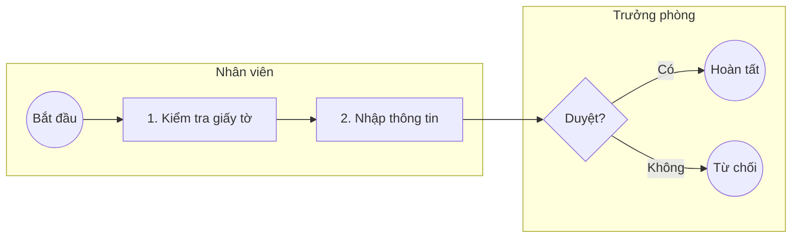

# Reference: Quy tắc sinh BPMN (BPMN Generation Rules v2.4.0)

Tài liệu này tổng hợp toàn bộ quy tắc kỹ thuật và thuật toán để sinh sơ đồ BPMN từ template gốc (V2.4.0), hỗ trợ Agent trong việc phân tích, confirm cấu trúc, thiết kế layout và sinh file kết quả.

---

## 1. Phân tích Input (Phase 1)

### 1.1. Xác định các thành phần

**Actors/Lanes - Ai thực hiện?**
- Tìm: "Nhân viên", "Trưởng phòng", "Hệ thống", "Kế toán"
- Mỗi actor = 1 lane

**Tasks - Làm gì?**
- Động từ + danh từ: "Lập đơn", "Phê duyệt", "Kiểm tra"
- **QUAN TRỌNG**: Task name phải có số thứ tự ở đầu
  - Format: `[STT]. [Tên task]`
  - Ví dụ: "1. Kiểm tra giấy tờ", "2. Nhập thông tin", "3. Gửi email"
- Phân loại:
  - **Manual Task** (🖐️): User làm thủ công, không qua hệ thống
    - Ví dụ: "1. Kiểm tra giấy tờ vật lý", "2. Ký tên trên giấy"
  - **User Task** (👤): User làm trên hệ thống
    - Ví dụ: "3. Nhập đơn vào phần mềm", "4. Phê duyệt qua app"
  - **Service Task** (⚙️): Hệ thống tự động xử lý
    - Ví dụ: "5. Gửi email tự động", "6. Tính toán phí"

**Gateways - Decision points**
- "Nếu... thì...", "Có... không?"
- Exclusive Gateway (XOR): Chọn 1 nhánh
- Parallel Gateway (AND): Xử lý đồng thời

**Events - Bắt đầu/Kết thúc**
- Start Event: "Bắt đầu", "Khởi tạo"
- End Event: "Hoàn tất", "Từ chối", "Hủy"

**Flows - Luồng xử lý**
- Sequence: A → B → C
- Conditional: "Nếu CÓ", "Nếu KHÔNG"
- Loop: "Quay lại bước..."

---

### 1.2. Tạo Bảng Xác Nhận (Confirmation Table)

Format chuẩn để show cho User review:

```markdown
## 📋 Xác nhận cấu trúc BPMN

Tôi đã phân tích quy trình của bạn. Đây là structure đề xuất:

| Bước | Tên | Lane | Loại Notation | Ghi chú |
|------|-----|------|---------------|---------|
| 1 | 1. Kiểm tra giấy tờ | Nhân viên | Manual Task 🖐️ | Kiểm tra vật lý |
| 2 | 2. Nhập thông tin | Nhân viên | User Task 👤 | Nhập vào hệ thống |
| 3 | 3. Gửi email | Hệ thống | Service Task ⚙️ | Tự động |

**Loại Task:**
- 🖐️ **Manual Task**: Thủ công, không qua hệ thống
- 👤 **User Task**: User thao tác trên hệ thống
- ⚙️ **Service Task**: Hệ thống tự động

**📊 Tổng quan:**
- Số lanes: X
- Số tasks: Y
- Số gateways: Z
- Độ phức tạp: [Simple/Medium/Complex]

**❓ Xác nhận:**
Bạn có đồng ý với structure này không? Hoặc cần điều chỉnh gì?
```

---

### 1.3. Quy tắc Tối Giản Hóa

**Rule 1: Gộp bước tuần tự đơn giản**

❌ Quá chi tiết:
```
1. Mở file Excel
2. Kiểm tra sao kê
3. Đối chiếu mã GD
4. Mapping trong file
5. Xác nhận thanh toán
```

✅ Tối giản:
```
1. Xác nhận thanh toán
   Ghi chú: Bao gồm kiểm tra sao kê, đối chiếu mã GD trong Excel
```

**Rule 2: Gộp các task setup/chuẩn bị**

❌ Quá chi tiết:
```
1. Tạo Google Form
2. Thiết kế trường input
3. Chia sẻ link
4. Phát tán qua email
5. Phát tán qua Zalo
```

✅ Tối giản:
```
1. Thu thập đơn đăng ký
   Ghi chú: Tạo và phát tán form qua email/Zalo
```

**Rule 3: KHÔNG gộp các bước quan trọng**

✅ PHẢI giữ nguyên:
- Decision points (gateways)
- Phê duyệt/chấp thuận
- Handoff giữa actors
- Các điểm có thể fail/retry
- Bước cần tracking/audit

**Rule 4: Multiple End Events - Mỗi nhánh End riêng**

❌ SAI - Merge về 1 End chung (làm rối):
```
Gateway → Nhánh A → ... → quay vòng về End chung
       → Nhánh B → ... → quay vòng về End chung
```

✅ ĐÚNG - Mỗi nhánh có End riêng:
```
Gateway → Nhánh A → End Event (Hoàn tất)
       → Nhánh B → End Event (Không đủ điều kiện)
       → Nhánh C → End Event (Từ chối)
```

Lý do: Tránh sequence flow quay vòng, làm diagram rối và khó đọc.

---

## 2. Thuật toán Layout & Positioning (Cho BPMN XML / Mermaid)

### 2.1. Pool & Lane Dimensions

- **Chiều cao Lane**: `Height = 200 + (số_row - 1) × 120`
  - Lane có nhiều tasks: chiều cao lớn hơn
  - Lane ít tasks: chiều cao nhỏ hơn
- **Chiều dài (Width) - Tự động**:
  - Tìm element xa nhất theo chiều ngang (x-coordinate)
  - `Pool width = maxX + padding (200px)`
  - Công thức: `Width = (lastElementX + lastElementWidth + 200)`
  - Ví dụ: Element cuối ở x=3000, width=120 → Pool width = 3000 + 120 + 200 = 3320

### 2.2. Element Sizing

| Element | Width | Height |
|---------|-------|--------|
| Task | 120px | 80px |
| Gateway | 50px | 50px |
| Start Event | r=18px | r=18px |
| End Event | r=18px | r=18px |

- Horizontal spacing: **170px** giữa các elements
- Vertical spacing: **120px** giữa các rows

### 2.3. Multiple End Events Layout

- Mỗi nhánh từ Gateway đi đến End riêng.
- KHÔNG merge nhiều nhánh về 1 End chung.
- **Tránh chồng chéo flows**:
  - End Events "Không đạt" PHẢI đặt OFFSET SANG PHẢI so với Gateway
  - Flow từ Gateway → phải đi ngang sang phải trước, rồi mới đi xuống End Event

```
Gateway (x=1000)
   ├─→ Flow "Đạt": đi thẳng xuống lane khác (x=1000)
   └─→ Flow "Không đạt": đi ngang sang phải (x=1080), rồi xuống End Event (x=1080)
```

**Công thức vị trí End Event:**
- `End_X = Gateway_X + 80px`
- `End_Y = Gateway_Y + 140px`
- Tên End Event phải mô tả outcome: "Hoàn tất", "Từ chối", "Không đủ điều kiện"

---

### 2.4. Quy tắc chống chồng chéo qua Lane (Cross-Lane Anti-Overlap Rule)

> 🚨 **Đây là quy tắc bắt buộc** — vi phạm sẽ tạo ra đường nối đi xuyên qua shape của task khác.

**Vấn đề:** Khi một flow đi qua **nhiều hơn 1 lane** (ví dụ: BQL → CuDan → BaoVe), đường thẳng đứng nối `T6 → T7` sẽ đi xuyên qua lane BQL — nếu có một task ở lane BQL tại cùng cột X, đường nối sẽ bị chồng lên trên task đó.

**Quy tắc đặt vị trí:**

| Tình huống | Hành động |
|------------|-----------|
| `A (lane 2) → B (lane 1) → C (lane 3)`: B và A cùng cột X → C **phải** ở cột X mới (lệch phải) | Tạo cột mới cho C: `C_X = B_X + col_spacing` |
| `A (lane 2) → B (lane 1) → C (lane 3)`: B và A **khác** cột X → C có thể cùng cột với B | Không cần lệch |
| Flow dọc đi qua lane trung gian có shape ở cùng cột | Thêm waypoint "hành lang" giữa 2 cột để tránh shape |

**Ví dụ thực tế (quy trình chung cư):**
```
❌ SAI - T5, T6, T7 cùng cột X=740:
  Col X=740: T5(BQL), T6(CuDan), T7(BaoVe)
  → Flow T6→T7 đi thẳng đứng qua BQL tại x=740, đè lên T5!

✅ ĐÚNG - Tách T6, T7 sang cột riêng:
  Col X=890: T5(BQL)          ← cột E
  Col X=975: hành lang routing ← khoảng trống giữa E và F
  Col X=1060: T6(CuDan) + T7(BaoVe) ← cột F
  → Flow T5→T6 dùng hành lang x=975 (không đè shape)
  → Flow T6→T7 thẳng đứng tại x=1060 (không có shape nào ở cùng cột tại BQL)
```

**Thuật toán kiểm tra:**
```
FOR mỗi flow (source → target) cần đi qua ≥1 lane trung gian:
  intermediate_lanes = get_lanes_between(source.lane, target.lane)
  FOR mỗi lane_X trong intermediate_lanes:
    Nếu TỒN TẠI task/gateway trong lane_X có cùng X-column với source:
      → target phải được đặt ở X-column MỚI (source_col + 1)
      → Dùng waypoint "hành lang" để routing edge tránh shapes
    ELSE:
      → target có thể dùng cùng X-column với source
```

**Waypoint hành lang (khi cần lệch):**
```xml
<!-- Ví dụ: T5(BQL, x=890) → T6(CuDan, x=1060) qua hành lang x=975 -->
<bpmndi:BPMNEdge bpmnElement="Flow_T5_T6">
  <di:waypoint x="950" y="518" />  <!-- right edge of T5 -->
  <di:waypoint x="975" y="518" />  <!-- enter hành lang (giữa 2 cột) -->
  <di:waypoint x="975" y="218" />  <!-- đi lên theo hành lang -->
  <di:waypoint x="1000" y="218" />  <!-- vào left edge of T6 -->
</bpmndi:BPMNEdge>
```


**Pool Width Auto-Calculation (Pseudo-code):**
```javascript
let maxX = 0;
elements.forEach(el => {
  const elementRightEdge = el.x + el.width;
  if (elementRightEdge > maxX) maxX = elementRightEdge;
});
const poolWidth = maxX - poolStartX + 200; // 200px padding
```

---

## 3. Cấu trúc BPMN XML (Generate BPMN File)

```xml
<?xml version="1.0" encoding="UTF-8"?>
<bpmn:definitions xmlns:bpmn="http://www.omg.org/spec/BPMN/20100524/MODEL"
                   xmlns:bpmndi="http://www.omg.org/spec/BPMN/20100524/DI"
                   xmlns:dc="http://www.omg.org/spec/DD/20100524/DC"
                   xmlns:di="http://www.omg.org/spec/DD/20100524/DI"
                   xmlns:xsi="http://www.w3.org/2001/XMLSchema-instance"
                   targetNamespace="http://bpmn.io/schema/bpmn"
                   id="Definitions_[TenQuyTrinh]">

  <bpmn:collaboration id="Collaboration_1">
    <bpmn:participant id="Participant_Pool"
                      name="[Tên quy trình]"
                      processRef="Process_1" />
  </bpmn:collaboration>

  <bpmn:process id="Process_1" isExecutable="false">
    <bpmn:laneSet>
      <bpmn:lane id="Lane_1" name="[Actor 1]">
        <bpmn:flowNodeRef>Task_1</bpmn:flowNodeRef>
      </bpmn:lane>
      <bpmn:lane id="Lane_2" name="[Actor 2]">
        <bpmn:flowNodeRef>Task_2</bpmn:flowNodeRef>
      </bpmn:lane>
    </bpmn:laneSet>

    <!-- Tasks với NUMBERED names -->
    <bpmn:manualTask id="Task_1" name="1. Kiểm tra giấy tờ">
      <bpmn:documentation>Kiểm tra hồ sơ vật lý, xác minh chứng từ gốc</bpmn:documentation>
      <bpmn:incoming>Flow_1</bpmn:incoming>
      <bpmn:outgoing>Flow_2</bpmn:outgoing>
    </bpmn:manualTask>

    <bpmn:userTask id="Task_2" name="2. Nhập thông tin">
      <bpmn:documentation>Nhập thông tin vào hệ thống quản lý</bpmn:documentation>
      <bpmn:incoming>Flow_2</bpmn:incoming>
      <bpmn:outgoing>Flow_3</bpmn:outgoing>
    </bpmn:userTask>

    <!-- Exclusive Gateway -->
    <bpmn:exclusiveGateway id="Gateway_1" name="[Câu hỏi?]">
      <bpmn:incoming>Flow_3</bpmn:incoming>
      <bpmn:outgoing>Flow_Yes</bpmn:outgoing>
      <bpmn:outgoing>Flow_No</bpmn:outgoing>
    </bpmn:exclusiveGateway>

    <!-- Multiple End Events -->
    <bpmn:endEvent id="End_Success" name="Hoàn tất">
      <bpmn:incoming>Flow_Yes</bpmn:incoming>
    </bpmn:endEvent>

    <bpmn:endEvent id="End_Reject" name="Từ chối">
      <bpmn:incoming>Flow_No</bpmn:incoming>
    </bpmn:endEvent>

    <!-- Sequence Flows -->
    <bpmn:sequenceFlow id="Flow_Yes" name="Có"
                       sourceRef="Gateway_1" targetRef="End_Success" />
    <bpmn:sequenceFlow id="Flow_No" name="Không"
                       sourceRef="Gateway_1" targetRef="End_Reject" />
  </bpmn:process>

  <!-- Diagram Interchange (DI) for layout -->
  <bpmndi:BPMNDiagram id="BPMNDiagram_1">
    <bpmndi:BPMNPlane bpmnElement="Collaboration_1">
      <bpmndi:BPMNShape bpmnElement="Participant_Pool" isHorizontal="true">
        <dc:Bounds x="160" y="80" width="[width]" height="[height]" />
      </bpmndi:BPMNShape>
      <bpmndi:BPMNShape bpmnElement="Lane_1" isHorizontal="true">
        <dc:Bounds x="190" y="80" width="[width]" height="[height]" />
      </bpmndi:BPMNShape>
      <bpmndi:BPMNShape bpmnElement="Task_1">
        <dc:Bounds x="[x]" y="[y]" width="120" height="80" />
      </bpmndi:BPMNShape>
      <bpmndi:BPMNShape bpmnElement="End_Success">
        <dc:Bounds x="[x]" y="[y]" width="36" height="36" />
      </bpmndi:BPMNShape>
      <bpmndi:BPMNEdge bpmnElement="Flow_Yes">
        <di:waypoint x="[x1]" y="[y1]" />
        <di:waypoint x="[x2]" y="[y2]" />
      </bpmndi:BPMNEdge>
    </bpmndi:BPMNPlane>
  </bpmndi:BPMNDiagram>
</bpmn:definitions>
```

---

## 4. Quy tắc Sinh SVG & Icons

### 4.1. Font Styling (Bắt buộc áp dụng cho TẤT CẢ text)

- **Font size**: 16px
- **Font weight**: bold (700)
- **Font family**: 'Arial', 'Segoe UI', sans-serif

Ví dụ:
```xml
<text x="[x]" y="[y]" font-size="16" font-weight="bold"
      font-family="Arial, sans-serif" text-anchor="middle" fill="#000">
  1. Kiểm tra giấy tờ
</text>
```

### 4.2. Icons (PHẢI là SVG path, KHÔNG dùng emoji text)

**Manual Task - Hand Icon 🖐️** (đặt tại góc trên trái task: x+5, y+5):
```xml
<g transform="translate([taskX+5], [taskY+5])">
  <rect width="20" height="20" fill="white" stroke="none" opacity="0.8"/>
  <!-- Palm -->
  <rect x="6" y="8" width="8" height="8" fill="none" stroke="#333" stroke-width="1.5"/>
  <!-- Fingers -->
  <line x1="7" y1="8" x2="7" y2="4" stroke="#333" stroke-width="1.5"/>
  <line x1="10" y1="8" x2="10" y2="3" stroke="#333" stroke-width="1.5"/>
  <line x1="13" y1="8" x2="13" y2="4" stroke="#333" stroke-width="1.5"/>
  <!-- Thumb -->
  <line x1="6" y1="10" x2="3" y2="10" stroke="#333" stroke-width="1.5"/>
</g>
```

**User Task - Person Icon 👤** (đặt tại góc trên trái task: x+5, y+5):
```xml
<g transform="translate([taskX+5], [taskY+5])">
  <rect width="20" height="20" fill="white" stroke="none" opacity="0.8"/>
  <circle cx="10" cy="6" r="3" fill="none" stroke="#333" stroke-width="1.5"/>
  <path d="M 10 9 L 10 14" stroke="#333" stroke-width="1.5" stroke-linecap="round"/>
  <path d="M 6 11 L 10 10 L 14 11" stroke="#333" stroke-width="1.5" stroke-linecap="round"/>
  <path d="M 10 14 L 7 18 M 10 14 L 13 18" stroke="#333" stroke-width="1.5" stroke-linecap="round"/>
</g>
```

**Service Task - Gear Icon ⚙️** (đặt tại góc trên trái task: x+5, y+5):
```xml
<g transform="translate([taskX+5], [taskY+5])">
  <rect width="20" height="20" fill="white" stroke="none" opacity="0.8"/>
  <path d="M 10 3 L 11 6 L 14 6 L 13 9 L 16 11 L 13 13 L 14 16 L 11 16 L 10 19 L 9 16 L 6 16 L 7 13 L 4 11 L 7 9 L 6 6 L 9 6 Z"
        fill="none" stroke="#333" stroke-width="1.5" stroke-linejoin="miter"/>
  <circle cx="10" cy="11" r="3" fill="none" stroke="#333" stroke-width="1.5"/>
</g>
```

### 4.3. Ví dụ hoàn chỉnh - Manual Task trong SVG

```xml
<!-- Task rectangle -->
<rect x="300" y="150" width="120" height="80"
      fill="#fff" stroke="#333" stroke-width="2" rx="10" ry="10"/>

<!-- Icon hand - góc trên trái -->
<g transform="translate(305, 155)">
  <rect width="20" height="20" fill="white" stroke="none" opacity="0.8"/>
  <rect x="6" y="8" width="8" height="8" fill="none" stroke="#333" stroke-width="1.5"/>
  <line x1="7" y1="8" x2="7" y2="4" stroke="#333" stroke-width="1.5"/>
  <line x1="10" y1="8" x2="10" y2="3" stroke="#333" stroke-width="1.5"/>
  <line x1="13" y1="8" x2="13" y2="4" stroke="#333" stroke-width="1.5"/>
  <line x1="6" y1="10" x2="3" y2="10" stroke="#333" stroke-width="1.5"/>
</g>

<!-- Task name - centered -->
<text x="360" y="195" font-size="16" font-weight="bold"
      font-family="Arial, sans-serif" text-anchor="middle" fill="#000">
  1. Kiểm tra giấy tờ
</text>
```

---

## 5. Cấu trúc File HTML (Tùy chọn, nếu Agent cần sinh HTML)

```html
<!DOCTYPE html>
<html lang="vi">
<head>
  <meta charset="UTF-8">
  <title>[Tên Quy Trình]</title>
  <style>
    * { box-sizing: border-box; margin: 0; padding: 0; }
    body { font-family: 'Segoe UI', sans-serif; background: #f5f5f5; color: #333; }
    .container { max-width: 1400px; margin: 0 auto; padding: 20px; background: white; }
    h1 { color: #2c3e50; border-bottom: 3px solid #3498db; padding-bottom: 15px; margin-bottom: 30px; }
    .diagram-container { text-align: center; margin: 30px 0; padding: 20px;
                         background: #fafafa; border-radius: 8px; overflow-x: auto; }
    table { width: 100%; border-collapse: collapse; margin: 20px 0; }
    th { background-color: #3498db; color: white; padding: 12px; text-align: left; }
    td { padding: 10px; border: 1px solid #ddd; }
    tr:nth-child(even) { background-color: #f9f9f9; }
    tr:hover { background-color: #f0f8ff; }
    .badge { display: inline-block; padding: 4px 10px; border-radius: 12px;
             font-size: 12px; font-weight: 600; }
    .badge-manual { background: #fff3e0; color: #e65100; }
    .badge-user   { background: #e3f2fd; color: #1976d2; }
    .badge-service{ background: #f3e5f5; color: #7b1fa2; }
    .badge-decision{ background: #fff9c4; color: #f57f17; }
  </style>
</head>
<body>
  <div class="container">
    <h1>[Tên Quy Trình]</h1>

    <h2>Quy trình dạng hình</h2>
    <div class="diagram-container">
      <!-- Nhúng SVG trực tiếp ở đây (sau khi user confirm OK) -->
      <!-- Hoặc dùng placeholder nếu chưa có SVG -->
    </div>

    <h2>Bảng mô tả quy trình</h2>
    <table>
      <thead>
        <tr>
          <th>Bước</th>
          <th>Tên bước</th>
          <th>Mô tả</th>
          <th>Thực hiện thủ công/hệ thống</th>
        </tr>
      </thead>
      <tbody>
        <!-- Rows -->
        <tr>
          <td>1</td>
          <td>1. Kiểm tra giấy tờ</td>
          <td>Kiểm tra hồ sơ vật lý, xác minh chứng từ gốc</td>
          <td><span class="badge badge-manual">Thủ công 🖐️</span></td>
        </tr>
      </tbody>
    </table>
  </div>
</body>
</html>
```

> **Ghi chú**: Badge classes:
> - `badge-manual` → Thủ công 🖐️ (Manual Task)
> - `badge-user` → Hệ thống 👤 (User Task)
> - `badge-service` → Tự động ⚙️ (Service Task)
> - `badge-decision` → Quyết định (Gateway)

---

## 6. Cấu trúc File Markdown Output

```markdown
# [Tên Quy Trình]

## 1. Quy trình dạng hình



## 2. Bảng mô tả quy trình

| Bước | Tên bước | Mô tả | Thực hiện thủ công/hệ thống |
|------|----------|-------|------------------------------|
| 1 | 1. Kiểm tra giấy tờ | Kiểm tra hồ sơ vật lý | Thủ công 🖐️ |
| 2 | 2. Nhập thông tin | Nhập vào phần mềm | Hệ thống 👤 |
```

---
> Version: 1.2.0 | Author: M2MBA | Last Updated: 2026-03-06
> Reference cho skill: ba-bpmn-doc-gen
