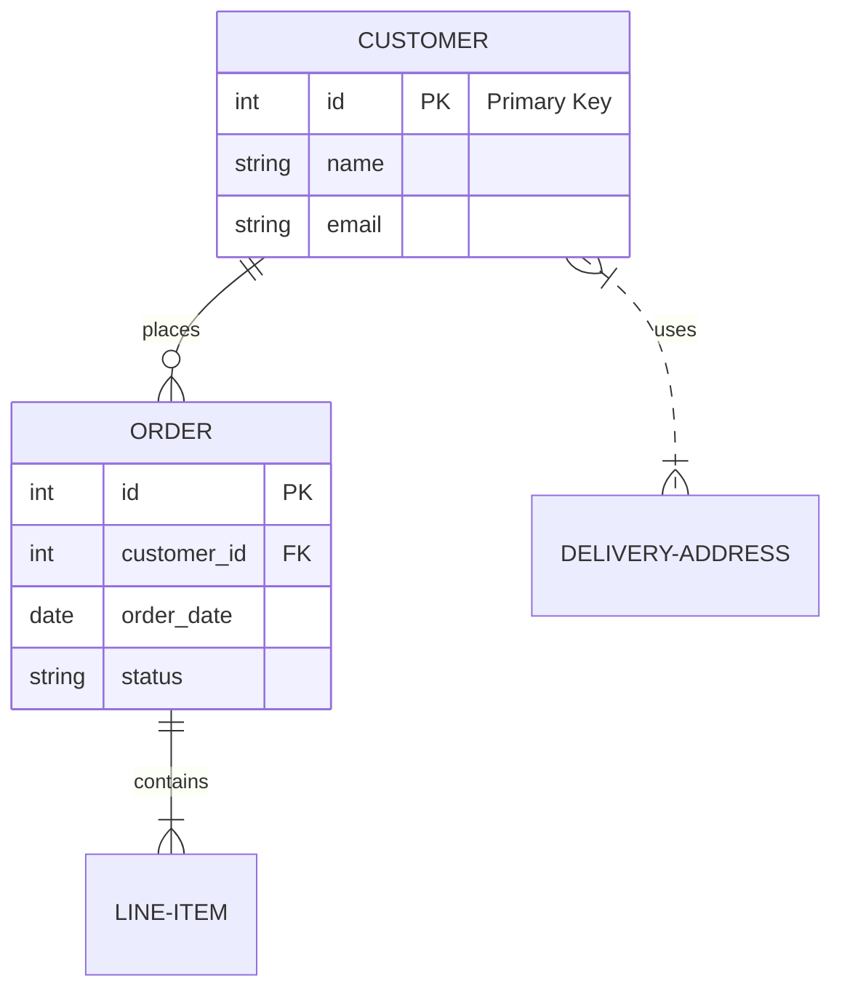
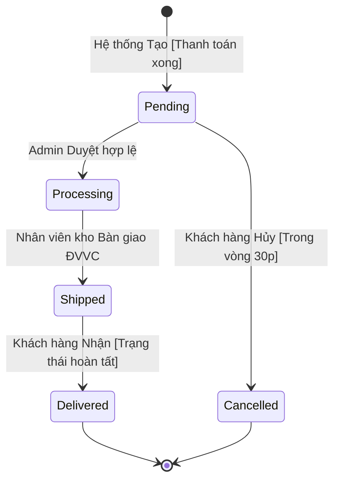

# ERD Document Template

**Version:** 1.0.0
**Author:** M2MBA
**Last Updated:** [YYYY-MM-DD]
**Description:** Entity-Relationship Diagram and Database Specification based on business requirements.

## 1. Overview
[Tổng quan về mục đích của ERD này, các module hoặc nhóm quy trình nghiệp vụ mà ERD bao phủ]

## 2. Entity-Relationship Diagram (ERD)
> [!NOTE] 
> Sơ đồ ERD sử dụng Mermaid.js để hiển thị. Copy code block bên dưới vào trình duyệt có hỗ trợ Mermaid (như GitHub, Notion) để xem biểu đồ.

## 3. Data Dictionary

*Mô tả chi tiết các thực thể (Entities) và thuộc tính (Attributes) xuất hiện trong ERD.*

### 3.1. [Tên Thực thể 1 - vd: CUSTOMER]
- **Mô tả:** [Ý nghĩa và vai trò của thực thể này trong hệ thống]
- **Attributes:**

| Attribute Name | Data Type | Key Type | Required | Description |
| :--- | :--- | :--- | :--- | :--- |
| `id` | int | PK | Yes | Khóa chính, định danh duy nhất |
| `name` | string | | Yes | Tên đầy đủ của khách hàng |
| `email` | string | | Yes | Địa chỉ email liên hệ |
| ... | ... | ... | ... | ... |

### 3.2. [Tên Thực thể 2 - vd: ORDER]
...

## 4. Relationships Specification

*Mô tả chi tiết các mối quan hệ (Relationships) giữa các thực thể.*

| Entity A | Relation | Entity B | Cardinality | Description / Business Rule |
| :--- | :--- | :--- | :--- | :--- |
| CUSTOMER | places | ORDER | 1 to Many (1:N) | Một khách hàng có thể đặt nhiều đơn hàng, nhưng một đơn hàng chỉ thuộc về một khách hàng. |
| ... | ... | ... | ... | ... |

## 5. Metadata / Notes
[Các ghi chú thêm về quy ước đặt tên (Naming convention), lưu ý về audit log fields (created_at, updated_at), deleted_at (soft delete), v.v nếu có yêu cầu từ stakeholder.]

## 6. State Diagram (Optional)
> [!NOTE] 
> Phần này dành cho (các) thực thể có luồng chuyển trạng thái rõ ràng (Ví dụ: ORDER, TICKET, APPROVAL).

### 6.1. State Machine: [Tên Thực Thể - vd: ORDER]

**State Transitions Table:**

*Mô tả chi tiết các luồng chuyển trạng thái và điều kiện.*

| Nguồn (From State) | Đích (To State) | Tác nhân (Actor) | Hành động (Action) | Điều kiện (Condition) |
| :--- | :--- | :--- | :--- | :--- |
| `Pending` | `Processing` | Admin | Nhấn Duyệt đơn | Trạng thái thanh toán hợp lệ |
| `Processing` | `Shipped` | Nhân viên Kho | Đóng gói & Giao ĐVVC | Đủ hàng trong kho |
| ... | ... | ... | ... | ... |
