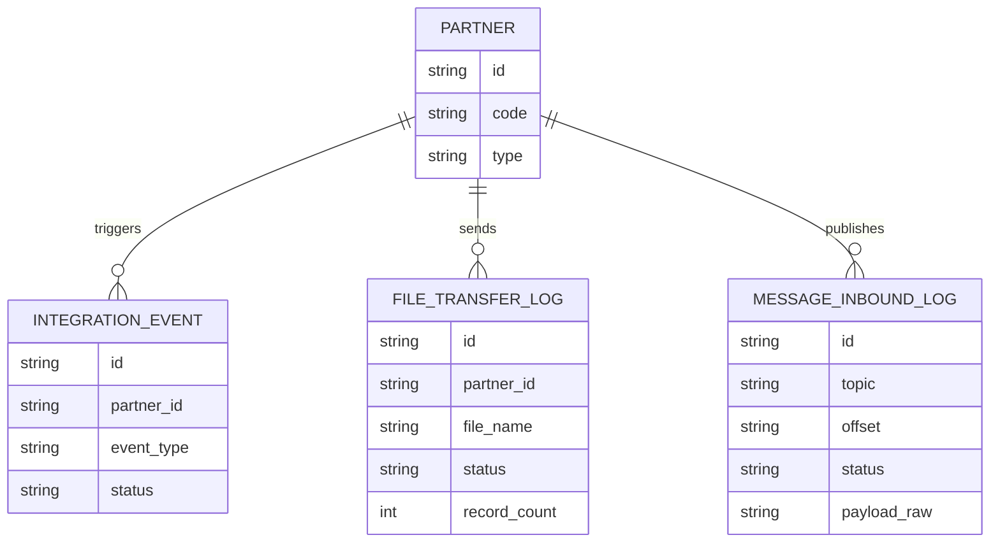

# ERD & Spec Tables – Tham chiếu cho Bước 4, 5, 7

---

## Bước 4 – Bảng đặc tả kỹ thuật (D) theo loại tích hợp

| Loại | Tên section D | Nội dung phân tích |
|---|---|---|
| REST API | Bảng phân tích API chi tiết | Method, URL, Auth, Status code, mã lỗi |
| File-based | Bảng đặc tả file tích hợp | Tên file, format, encoding, delimiter, layout cột, naming convention, lịch truyền |
| Message Queue | Bảng đặc tả message/event | Topic/Queue name, message format (JSON/Avro/Protobuf), schema version, delivery guarantee |
| SOAP | Bảng phân tích WSDL/Operation | Operation name, namespace, SOAPAction, Fault code |
| Hybrid | Chia thành nhiều bảng D theo từng kiểu | Mỗi kiểu có bảng riêng, đặt cạnh nhau |

### Ví dụ REST API

| Tên API | URL | Method | Mục đích | Auth | Status codes |
|---------|-----|--------|----------|------|-------------|
| Create Customer | `/v1/customers` | POST | Tạo KH tại đối tác | Bearer Token | 201, 400, 409 |
| Create Shipment | `/v1/shipments` | POST | Tạo đơn vận chuyển | Bearer Token | 201, 400, 422 |
| Get Tracking | `/v1/trackings/{id}` | GET | Tra cứu trạng thái | Bearer Token | 200, 404 |

### Ví dụ File-based

| Tên file / Pattern | Format | Encoding | Delimiter | Tần suất | Chiều | Thư mục SFTP | Ghi chú |
|---|---|---|---|---|---|---|---|
| `ORDER_YYYYMMDD.csv` | CSV | UTF-8 | `,` | Hàng ngày 02:00 | Inbound | `/inbox/orders/` | Header row = dòng 1 |
| `RECONCILE_YYYYMMDD.xlsx` | Excel | — | — | Hàng tuần T2 | Outbound | `/outbox/recon/` | Sheet "Data", bỏ sheet "Summary" |

### Ví dụ Message Queue

| Topic / Queue | Broker | Format | Schema version | Producer | Consumer | Delivery | Retention | Ghi chú |
|---|---|---|---|---|---|---|---|---|
| `order.status.changed` | Kafka | JSON | v2 | Đối tác | BE nội bộ | At-least-once | 7 ngày | DLQ: `order.status.changed.dlq` |
| `shipment.created` | Kafka | Avro | v1 | BE nội bộ | Đối tác | Exactly-once | 3 ngày | Schema Registry tại đối tác |

---

## Bước 5 – Bảng mapping dữ liệu (D', E)

**Header chuẩn** cho mỗi API / file / message (`[IN]` = đầu vào gửi đi, `[OUT]` = đầu ra nhận về):

| Field / Cột | IN/OUT | Type | Required | Source | Default/Rule | Validation | Mapping nội bộ | Persist? | Purpose | Notes |
|---|---|---|---|---|---|---|---|---|---|---|

**Quy tắc Source theo loại:**

| Loại | Source [IN] |
|---|---|
| REST API | UI nhập / DB cấu hình / BE tự sinh / hệ thống khác |
| File-based | Cột file (ghi rõ tên cột/vị trí), giá trị cố định, hoặc từ cấu hình job |
| Message Queue | message header / message body field / metadata (offset, timestamp) |
| SOAP | XML element / attribute / SOAP header |

**[OUT] mọi loại:** Xác định `Mapping nội bộ` (bảng/trường nào), `Persist?` (Yes/No), `Purpose` (truy vết / đối soát / hiển thị / phục vụ call/job tiếp theo / đa đối tác), `Notes` (lưu ý normalization nếu nhiều đối tác dùng field/format khác nhau).

---

## Bước 7 – ERD tích hợp (G)

### Bảng đề xuất thêm theo loại tích hợp

| Loại | Bảng đặc thù nên có |
|---|---|
| REST API | `INTEGRATION_LOG` (log request/response raw), `PARTNER_CONFIG` (cấu hình per-partner) |
| File-based | `FILE_TRANSFER_LOG` (tên file, thời điểm, status, record count, lỗi), `FILE_PROCESSING_ERROR` |
| Message Queue | `MESSAGE_INBOUND_LOG` (offset, topic, payload raw, trạng thái xử lý), `DEAD_LETTER_LOG` |
| Tất cả | `PARTNER` (danh mục đối tác), `INTEGRATION_EVENT` (audit trail chung cho mọi loại tích hợp) |

### ERD mẫu

### Nguyên tắc thiết kế ERD

- Nếu user **CÓ ERD hiện tại**: Đọc ERD → chỉ liệt kê field cần bổ sung trên bảng đã có + bảng mới cần tạo → hỏi confirm user trước khi vẽ.
- Nếu user **KHÔNG có ERD**: Đề xuất ERD từ đầu bằng Mermaid `erDiagram`, đánh dấu "Giả định".
- Luôn tư duy theo hướng: hỗ trợ **nhiều đối tác cùng loại**, giữ **raw data** để đối soát, có bảng **mapping chuẩn hoá** (status, service, product…).
