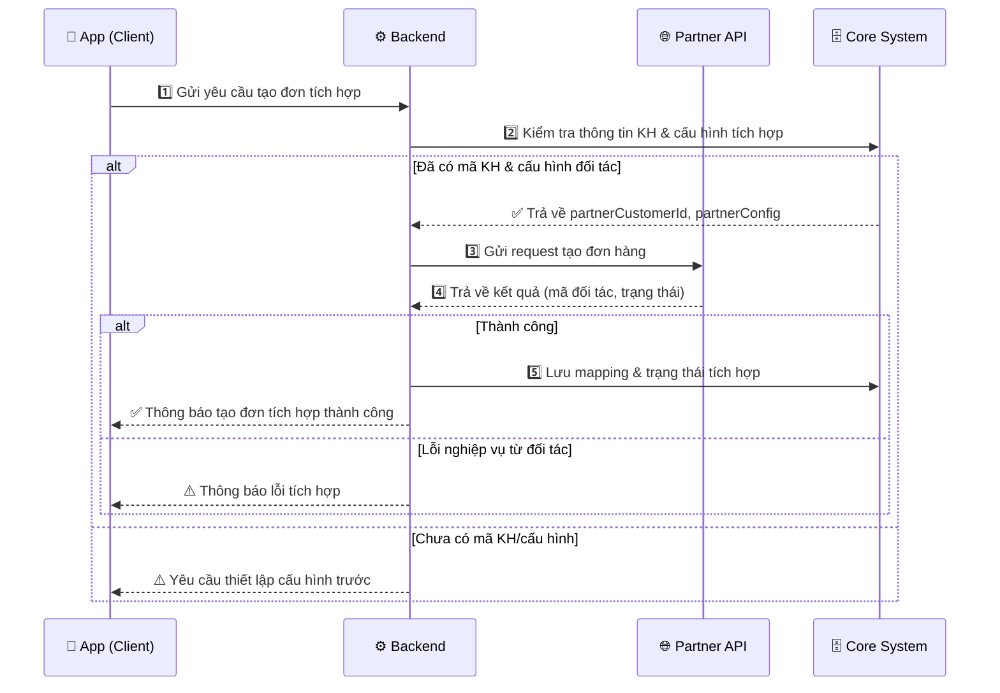
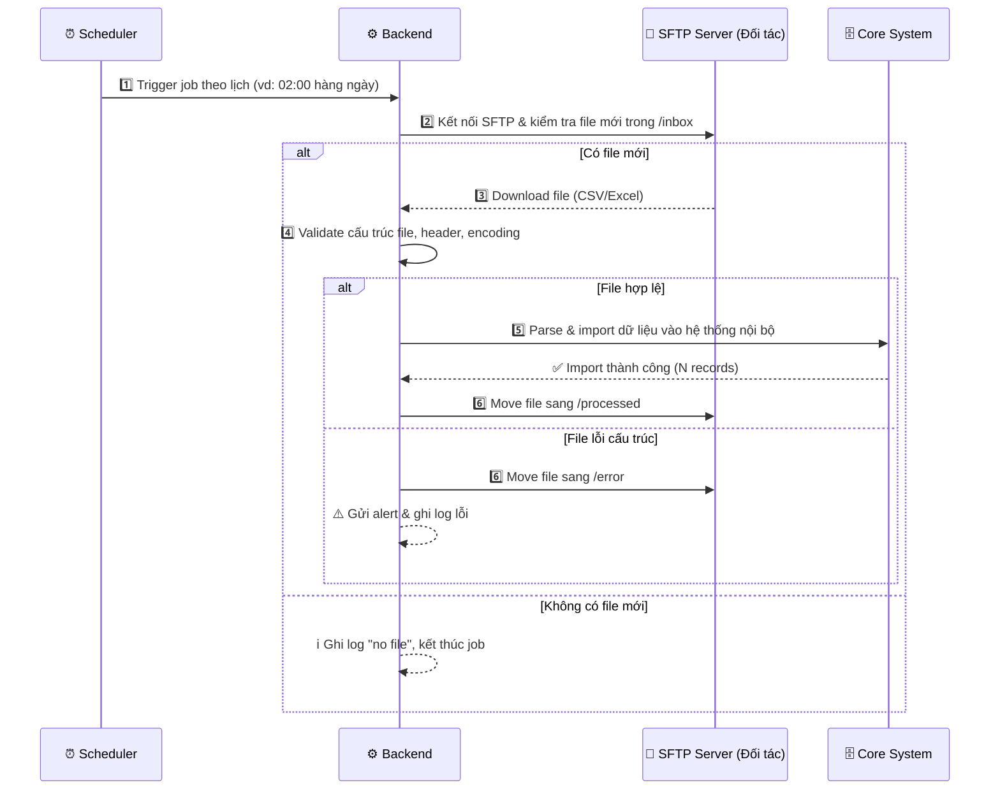
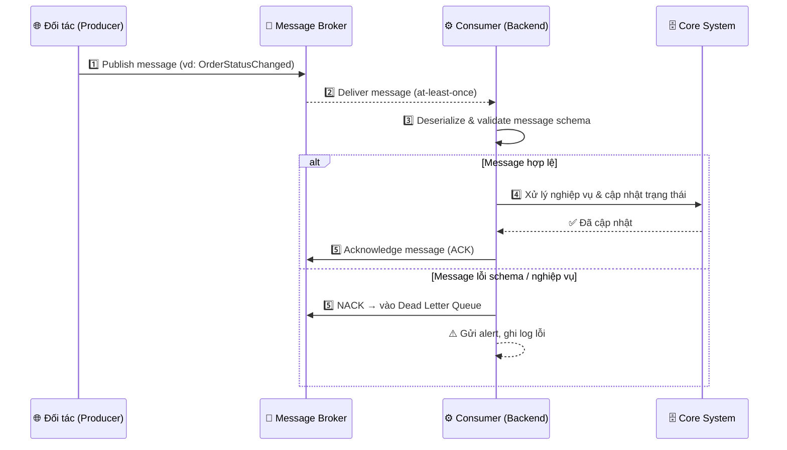

# Sequence Diagram Examples – Tham chiếu cho Bước 3

## Participant theo loại tích hợp

| Loại | Participant điển hình |
|---|---|
| REST API | App (Client) · Backend · Partner API · Core System |
| File-based | Scheduler · Backend · SFTP/S3 Server · File Processor · Core System |
| Message Queue | Producer (BE) · Message Broker (Topic/Queue) · Consumer (BE) · Core System |
| SOAP | App · Backend · SOAP Gateway · Core System |
| Hybrid | Kết hợp — tách thành 2 sequence riêng nếu luồng phức tạp |

---

## 🌐 Ví dụ REST API

---

## 📁 Ví dụ File-based (SFTP)

---

## 📨 Ví dụ Message Queue (Kafka)

