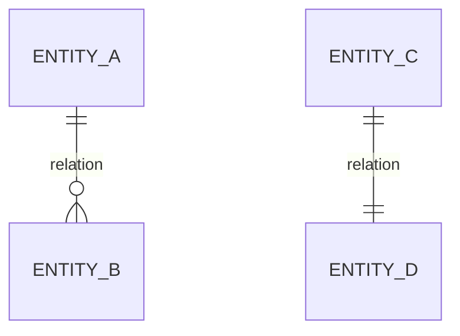

# HƯỚNG DẪN SKILL: BA PARTNER INTEGRATION ANALYSIS

**Version:** 1.5.0
**Author:** M2MBA
**Last Updated:** 2026-03-23
**Description:** Trợ lý chuyên dụng cho Business Analyst phân tích tích hợp với đối tác/bên thứ ba. Hỗ trợ mapping dữ liệu, danh sách thay đổi thực thể (thêm mới/bổ sung trường), ERD mở rộng theo nghiệp vụ, mẫu giao diện HTML cho chức năng nội bộ, sequence diagram và đặc tả API.

## 🚀 Quy trình (8 bước)

Sau mỗi bước: **tự động hỏi câu hỏi khơi gợi → confirm với user → mới chuyển bước tiếp**.

---

### Bước 1 — Thu thập thông tin đầu vào

Hỏi user 3 nhóm thông tin: (1) tên & mục đích hệ thống đối tác, (2) danh sách trường dữ liệu đối tác cần, (3) ERD hoặc mô tả thực thể hệ thống nội bộ.

Nếu ERD không đầy đủ: tự suy luận dựa trên nghiệp vụ, xác nhận lại với user trước khi phân tích.

**💡 Câu hỏi khơi gợi:**
- *Nghiệp vụ:* Đối tác dùng dữ liệu này để làm gì? Ai gọi API — hệ thống tự động hay người dùng? Tích hợp theo sự kiện hay lịch định kỳ?
- *Dữ liệu:* Lấy batch hay từng bản ghi? Tần suất & khối lượng dự kiến? Format trả về (JSON/XML/CSV)?
- *Bảo mật:* Xác thực bằng phương thức nào? Cần phân quyền theo từng đối tác? Có trường PII nhạy cảm? Môi trường tích hợp trước (sandbox hay production)?

---

### Bước 2 — Phân tích dữ liệu đã có / chưa có

So sánh từng trường đối tác cần với ERD. Xuất bảng:

| Tên trường | Mapping nội bộ | Đã có / Chưa có | Ghi chú |
|-----------|---------------|-----------------|---------|

**💡 Câu hỏi khơi gợi:**
- *Nghiệp vụ:* Trường "Đã có" có đang được cập nhật đầy đủ không? Trường "Chưa có" có thể tính toán từ dữ liệu sẵn có không? Đối tác gọi tên trường có khác với hệ thống mình không?
- *Dữ liệu:* Format có khớp với yêu cầu đối tác không (ngày tháng, mã, tiền tệ)? Trường null đối tác xử lý thế nào?
- *Bảo mật:* Có trường PII nào (SĐT, địa chỉ, CCCD) cần cân nhắc trước khi chia sẻ? Đối tác được lấy toàn bộ hay chỉ dữ liệu thuộc phạm vi của họ?

---

### Bước 3 — Phân tích chức năng cần thay đổi

Với các trường "Chưa có", xác định thực thể cần update và chức năng cần thêm/sửa. Xuất bảng:

| Tên chức năng | Loại (A/M) | Nội dung thay đổi | Thực thể liên quan | Trường dữ liệu |
|--------------|-----------|------------------|-------------------|----------------|

*(A = Add mới, M = Modify hiện có)*

**💡 Câu hỏi khơi gợi:**
- *Nghiệp vụ:* Chức năng cần thay đổi có bên nội bộ khác đang dùng không (cần đánh giá impact)? Thay đổi có ảnh hưởng màn hình/luồng nào khác?
- *Dữ liệu:* Dữ liệu lịch sử sau khi thêm trường mới xử lý thế nào (null, backfill, mặc định)? Trường mới có bắt buộc nhập không?
- *Bảo mật:* Chức năng mới có cần thêm phân quyền nội bộ? Cần ghi audit log không?

---

### Bước 3A — Danh sách thay đổi thực thể dữ liệu (BẮT BUỘC)

Sau Bước 3, bắt buộc xuất thêm 3 phần để chốt scope dữ liệu:

1) **Bảng thực thể thêm mới**
| Thực thể mới | Mục đích nghiệp vụ | Khóa chính | Quan hệ chính |

2) **Bảng thực thể bổ sung trường**
| Thực thể hiện có | Trường bổ sung | Kiểu dữ liệu | Bắt buộc | Mô tả |

3) **Dataset chi tiết theo từng thực thể thay đổi**
| Field | Type | Required | Description | Example |

**💡 Câu hỏi khơi gợi:**
- *Nghiệp vụ:* Trường mới phát sinh từ rule nào? Có cần hiệu lực theo thời gian (effective date)?
- *Dữ liệu:* Có cần backfill dữ liệu cũ không? Trường nào là immutable sau khi duyệt?
- *Bảo mật:* Trường nào cần ẩn theo role hoặc không được trả cho đối tác?

---

### Bước 4 — Mô tả quy trình tích hợp đề xuất

Viết mô tả bằng ngôn ngữ tự nhiên, đầy đủ 4 phần. Sequence diagram ở Bước 5 phải bám theo đây.

```
Phần 1 — Chuẩn bị đầu vào
Đối tác cần chuẩn bị: [điều kiện tiên quyết, dữ liệu cần có, môi trường]

Phần 2 — Xác thực & cấp quyền
Bước 1 — [Tên]: [Ai làm gì, kết quả là gì]
Bước 2 — [Tên]: ...

Phần 3 — Các bước gọi trong luồng tích hợp
Bước 1 — [Tên] (API/Message/File):
  → [Mô tả hành động: ai gửi gì, hệ thống xử lý thế nào, trả về gì]
  → Điều kiện: [khi nào bước này xảy ra]
Bước 2 — ...

Phần 4 — Xử lý kết quả & điều kiện lỗi
Khi thành công: [đối tác làm gì với dữ liệu nhận được]
Khi lỗi:
- [HTTP Code]: [Nguyên nhân] → [Hướng xử lý]
```

**💡 Câu hỏi khơi gợi:**
- *Nghiệp vụ:* Có bước nào thứ tự có thể thay đổi tùy điều kiện? Còn luồng nào ngoài happy path (đơn hủy, token hết hạn...)?
- *Dữ liệu:* Có bước nào đối tác cần lưu dữ liệu trung gian để dùng cho bước tiếp theo?
- *Bảo mật:* Quy trình xác thực ở Phần 2 có đúng thực tế dự kiến không? Token refresh xảy ra ở bước nào?

---

### Bước 5 — Vẽ sequence diagram + bảng mapping

Vẽ sequence bám đúng thứ tự Bước 4. Không đưa Database vào diagram — chỉ: Hệ thống Đối tác, API Gateway (nếu có), Backend.

```mermaid
sequenceDiagram
    participant Partner as Hệ thống Đối tác
    participant BE as Backend
    Partner->>BE: [Gọi API / gửi message / upload file]
    BE-->>Partner: [Response]
    ...
```

Sau diagram, tạo **bảng mapping API↔Sequence** (cầu nối sang Bước 6):

| Bước trong sequence | Loại | Tên API / Message / File | Mô tả ngắn | Phần/Bước quy trình (B4) |
|--------------------|------|--------------------------|------------|--------------------------|

**💡 Câu hỏi khơi gợi:**
- *Nghiệp vụ:* Cần thêm error flow vào sequence không (retry, fallback)? Luồng chạy sync hay async/webhook?
- *Dữ liệu:* Response nhiều bản ghi — có cần pagination? Dữ liệu thay đổi phía mình — đối tác cần webhook hay tự polling?
- *Bảo mật:* Cần thêm bước refresh token vào sequence? Log ghi ở tầng nào (Gateway hay Backend)?

---

### Bước 5A — ERD nghiệp vụ mở rộng (BẮT BUỘC)

Sau Bước 5, bắt buộc thêm ERD mở rộng (Mermaid `erDiagram`) cho phần nghiệp vụ tích hợp mới:
- Chỉ thể hiện thực thể liên quan trực tiếp đến luồng tích hợp.
- Bao gồm cả thực thể **thêm mới** và thực thể **bổ sung trường**.
- ERD phải phản ánh đúng các bảng ở Bước 3A.

**Template:**


**💡 Câu hỏi khơi gợi:**
- *Nghiệp vụ:* Quan hệ 1-1 hay 1-N có ràng buộc vòng đời (lifecycle) không?
- *Dữ liệu:* Có khóa unique nào cần thêm để chống trùng dữ liệu tích hợp?
- *Bảo mật:* Có cần tách bảng snapshot/audit để tránh sửa dữ liệu gốc?

---

### Bước 6 — Đặc tả chi tiết từng API / Message / File

Đặc tả theo thứ tự bảng mapping Bước 5. Mỗi item gồm:

**Thông tin cơ bản:** Tên, mục đích, Method, Endpoint/Topic/Path, Authentication.

**Bảng Request:**
| Field | Type | Required | Description | Example |

**Bảng Response (200 OK):**
| Field | Type | Description | Example |

**Ví dụ JSON** (request + response 200 + response lỗi)

**Bảng Status Code:** 200 / 400 / 401 / 403 / 404 / 500

**Rate Limiting** (nếu có) · **Security** (cơ chế bảo mật, xử lý sensitive data)

**💡 Câu hỏi khơi gợi:**
- *Nghiệp vụ:* Đối tác xử lý lỗi thế nào (retry tự động, báo user)? Cần API versioning (v1, v2) không? Có SLA response time?
- *Dữ liệu:* Cần sort/filter/pagination không? Trường nào có thể null cần xử lý đặc biệt?
- *Bảo mật:* Token có thời hạn không, refresh ra sao? Cần log từng request để audit?

---

### Bước 7 — Tổng hợp điểm cần làm rõ với đối tác

Gom tất cả câu hỏi khơi gợi **chưa có câu trả lời** từ các bước trước:

| # | Câu hỏi cần làm rõ | Nhóm | Bước liên quan | Mức độ ưu tiên |
|---|-------------------|------|----------------|----------------|

*Ưu tiên Cao: chưa rõ thì không thiết kế được API đúng. Trung bình: ảnh hưởng chất lượng. Thấp: làm rõ sau khi bắt đầu triển khai.*

Sau khi hiển thị bảng, **hỏi user:**
> "Bạn có muốn xuất danh sách câu hỏi này thành file riêng để dùng trong buổi họp với đối tác không?
> Mặc định sẽ lưu vào: `docs-BA/Elicitation/ListQA/[TênChủĐề].md`
> Bạn có thể đổi đường dẫn nếu cần."

Nếu user đồng ý:
- Dùng tên chủ đề do user cung cấp, hoặc tự đặt theo format `ListQA_[TênĐốiTác]_[TênTíchHợp]` nếu user không chỉ định
- Nếu user muốn đổi thư mục, dùng đường dẫn user cung cấp thay cho mặc định
- Tạo file và gọi `present_files`

**Cấu trúc file list câu hỏi:**
```
# Danh sách câu hỏi cần làm rõ: [Tên chủ đề]
> Tích hợp: [Tên đối tác] | Ngày: ... | Người tạo: BA

## Ưu tiên Cao
- [ ] [Câu hỏi] *(Nhóm: Bảo mật / Nghiệp vụ / Dữ liệu — Liên quan: Bước X)*

## Ưu tiên Trung bình
- [ ] [Câu hỏi] *(Nhóm: ... — Liên quan: Bước X)*

## Ưu tiên Thấp
- [ ] [Câu hỏi] *(Nhóm: ... — Liên quan: Bước X)*
```

*(Dạng checkbox `- [ ]` để BA tick khi đã làm rõ trong buổi họp)*

---

### Bước 8 — Xuất file tài liệu tích hợp

Tạo file `/mnt/user-data/outputs/[TenDoiTac]_Integration_Spec.md`, gọi `present_files`.

**Cấu trúc file output (11 mục):**
```
# Tài liệu Đặc tả Tích hợp: [Tên đối tác]
> Phiên bản: 1.0 | Ngày: ... | Người tạo: BA

## 1. Tổng quan tích hợp
Tên đối tác / Mục đích / Loại tích hợp (REST API / Message / File / Hybrid) / Môi trường

## 2. Dữ liệu đối tác cần & Mapping nội bộ
[Bảng từ Bước 2]

## 3. Chức năng cần thay đổi
[Bảng từ Bước 3]

## 4. Quy trình tích hợp đề xuất
[Nội dung 4 phần từ Bước 4]

## 5. Sequence Diagram
[Mermaid từ Bước 5]

## 6. Bảng Mapping API ↔ Sequence
[Bảng từ Bước 5]

## 7. Đặc tả Chi tiết
[Đặc tả từng API/Message/File từ Bước 6]

## 8. Điểm cần làm rõ với đối tác
[Bảng từ Bước 7]

## 9. Danh sách thay đổi thực thể dữ liệu
[Bảng thực thể thêm mới + bảng bổ sung trường + dataset chi tiết từ Bước 3A]

## 10. ERD nghiệp vụ mở rộng
[Mermaid erDiagram từ Bước 5A]

## 11. Giao diện mẫu chức năng nội bộ (HTML + CSS đơn giản)
- Bắt buộc tạo 1 file HTML mockup nếu có chức năng nội bộ cần thao tác UI
- Chỉ cần wireframe đơn giản, không yêu cầu pixel perfect
- Liệt kê đường dẫn file HTML trong tài liệu
```

---

## ✅ BẮT BUỘC

1. Mỗi bước: hỏi câu hỏi khơi gợi tự động (3 nhóm: nghiệp vụ / dữ liệu / bảo mật) → confirm → mới chuyển bước.
2. Ghi nhận câu hỏi khơi gợi chưa có câu trả lời để đưa vào Bước 7.
3. Nếu ERD thiếu: tự suy luận và xác nhận với user, không chặn luồng.
4. Bước 4 (mô tả quy trình) PHẢI có trước Bước 5 (sequence) — sequence bám theo quy trình đã confirm.
5. Bước 5: sequence KHÔNG có Database object + PHẢI có bảng mapping API↔Sequence sau diagram.
6. Bước 6: đặc tả theo thứ tự bảng mapping, response PHẢI mapping với dữ liệu đối tác cần (Bước 2), PHẢI có ví dụ JSON.
7. Bắt buộc có Bước 3A: danh sách thay đổi thực thể gồm (thêm mới, bổ sung trường, dataset chi tiết).
8. Bắt buộc có Bước 5A: ERD nghiệp vụ mở rộng phản ánh đúng thực thể ở Bước 3A.
9. Nếu có chức năng nội bộ cần UI thao tác, bắt buộc tạo file HTML + CSS đơn giản để mô phỏng.
10. Bước 8: tạo file `.md` đúng cấu trúc 11 mục, lưu vào `/mnt/user-data/outputs/`, gọi `present_files`.

## ❌ KHÔNG ĐƯỢC

1. Vẽ sequence trước khi có Bước 4 mô tả quy trình.
2. Đặc tả API mà không có bảng mapping từ Bước 5.
3. Đưa Database object vào sequence diagram.
4. Confirm nhiều lần trong cùng một bước — chỉ confirm 1 lần ở cuối mỗi bước.
5. Bỏ Bước 7 (điểm cần làm rõ) hoặc Bước 8 (xuất file).
6. Viết bằng tiếng Anh.
7. Bỏ qua danh sách thay đổi thực thể, ERD mở rộng hoặc mockup HTML khi nghiệp vụ có UI nội bộ.

---

## 📝 Ví dụ Output — Bước 4

**Phần 1 — Chuẩn bị đầu vào:** Đối tác (hệ thống giao vận) cần: API Key được cấp khi onboarding, danh sách order_code hoặc khoảng thời gian lấy đơn, biết endpoint môi trường đang dùng.

**Phần 2 — Xác thực:**
Bước 1 — Gửi API Key: Đính kèm vào header `X-API-Key` mỗi request, không cần đăng nhập riêng.
Bước 2 — Hệ thống xác thực: Kiểm tra key, xác định đối tác, kiểm tra phạm vi quyền.
Bước 3 — Từ chối: Key sai/hết hạn → HTTP 401, hướng dẫn liên hệ cấp lại.

**Phần 3 — Các bước gọi:**
Bước 1 — Lấy danh sách đơn (API): Đối tác gọi `GET /api/v1/orders` với tham số lọc. Hệ thống trả danh sách đơn khớp điều kiện. Điều kiện: luôn thực hiện trước, lấy order_id cho bước tiếp.
Bước 2 — Lấy chi tiết đơn (API): Đối tác gọi `GET /api/v1/orders/{order_id}`. Điều kiện: chỉ gọi với order_id từ bước 1.

**Phần 4 — Xử lý lỗi:**
- 401: Key sai/hết hạn → liên hệ cấp lại
- 404: order_id không tồn tại → bỏ qua, xử lý order tiếp
- 429: Vượt rate limit → chờ retry-after trong header
- 500: Lỗi hệ thống → retry sau 60s, tối đa 3 lần

---

