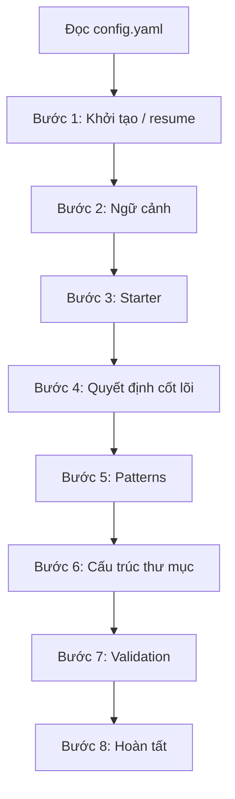

# Hướng dẫn học viên: Skill `bmad-create-architecture` làm gì từng bước?

Tài liệu này giúp bạn **hiểu mục đích và kết quả** của mỗi bước trong workflow tạo kiến trúc BMAD, kèm **ví dụ minh họa** (kịch bản giả định). Chi tiết quy tắc thực thi nằm trong `workflow.md` và từng file `steps/step-*.md`.

---

## Bạn sẽ học được gì?

- **Skill làm gì:** Dẫn dắt (facilitate) việc **ghi lại quyết định kiến trúc** vào một file (thường là `architecture.md` trong thư mục planning), để sau này **AI agent và dev triển khai thống nhất** — không mỗi người chọn một stack/pattern khác nhau.
- **Không phải:** Agent tự “bịa” full kiến trúc một lần mà không đọc PRD và không xác nhận với bạn.

---

## Ví dụ chạy xuyên suốt: “Mini PMS”

Giả sử bạn có dự án **quản lý dự án nội bộ** với PRD ghi:

- Đăng nhập theo vai trò (PM, thành viên).
- CRUD dự án, task, comment; thông báo khi có giao việc mới.
- Báo cáo đơn giản xuất CSV; ~100 người dùng đồng thời tối đa.

Các bước dưới đây minh họa **từng giai đoạn** sẽ bổ sung **loại thông tin gì** vào tài liệu kiến trúc.

---

## Luồng tổng quan

---

## Trước khi bắt đầu: Cấu hình

**Làm gì:** Agent đọc `_bmad/bmm/config.yaml` để biết tên dự án, thư mục output, ngôn ngữ giao tiếp, v.v.

**Ví dụ:** `communication_language: vi` → agent trao đổi với bạn bằng tiếng Việt; `planning_artifacts` trỏ tới nơi sẽ tạo `architecture.md`.

---

## Bước 1 — Khởi tạo (`step-01-init.md` / `step-01b-continue.md`)

| Khía cạnh | Nội dung |
|-----------|----------|
| **Làm gì** | Tìm xem đã có file `*architecture*.md` chưa. Nếu có và có `stepsCompleted` → **tiếp tục** (bước 01b). Nếu chưa → **khám phá tài liệu đầu vào** (PRD, UX, research, `project-context.md`…), **xác nhận với bạn** danh sách file, rồi tạo/ghi nhận document từ template. |
| **Vì sao quan trọng** | Không có PRD đã xác nhận thì kiến trúc dễ lệch yêu cầu. |
| **Ví dụ Mini PMS** | Agent tìm được `prd.md`, `ux-design.md`; bạn xác nhận “đủ rồi, không thêm file”. Agent khởi tạo `architecture.md` với frontmatter (`stepsCompleted`, `inputDocuments`…). |

**Lưu ý học viên:** Bước 1 thường kết thúc bằng menu (ví dụ **[C] Continue**). Chỉ khi bạn chọn tiếp tục theo đúng quy tắc trong file step, agent mới sang bước 2 và **phải đọc trọn vẹn** `step-02-context.md`.

---

## Bước 2 — Phân tích ngữ cảnh (`step-02-context.md`)

| Khía cạnh | Nội dung |
|-----------|----------|
| **Làm gì** | Từ PRD/UX: rút **yêu cầu chức năng (FR)**, **phi chức năng (NFR)**, quy mô, ràng buộc — và **hệ quả kiến trúc** (cần gì về mặt hệ thống), **chưa** khóa chi tiết công nghệ nếu chưa đến lúc. |
| **Ví dụ Mini PMS** | FR: CRUD dự án/task, phân quyền. NFR: ~100 concurrent users, audit cần xem lại ai sửa task. **Hệ quả:** cần mô hình auth/authorization, có thể cần kênh thông báo (real-time hoặc polling), cần lưu vết thay đổi — **chưa** quyết React hay Vue ở bước này. |

**Phân biệt:** Bước 2 trả lời *“yêu cầu ép kiến trúc phải giải quyết gì?”* — chưa phải *“chọn PostgreSQL hay MySQL”*.

---

## Bước 3 — Starter / nền tảng (`step-03-starter.md`)

| Khía cạnh | Nội dung |
|-----------|----------|
| **Làm gì** | Chọn **boilerplate** phù hợp (CLI, monorepo, framework…), **kiểm tra phiên bản** (thường qua tra cứu hiện tại, không cứng nhắc số cũ). |
| **Ví dụ Mini PMS** | Web app: `Vite + React + TypeScript`, package manager `pnpm`, ESLint cấu hình flat — ghi rõ **tại sao** phù hợp team và PRD. |

---

## Bước 4 — Quyết định kiến trúc cốt lõi (`step-04-decisions.md`)

| Khía cạnh | Nội dung |
|-----------|----------|
| **Làm gì** | Quyết định **theo nhóm**: database, API, auth, hosting, queue, tích hợp…; mỗi nhóm có lý do và phương án thay thế; sau các khối lớn thường có menu **A / P / C** (xem mục dưới). |
| **Ví dụ Mini PMS** | REST + OpenAPI; PostgreSQL; JWT access + refresh cookie httpOnly; object storage cho file đính kèm (nếu có); Redis cho session/cache; worker xử lý gửi email thông báo. |

**Phân biệt với bước 2:** Bước 4 là *“chốt công nghệ và cách tích hợp”*; bước 2 là *“ép buộc nghiệp vụ lên kiến trúc”*.

---

## Bước 5 — Patterns & nhất quán (`step-05-patterns.md`)

| Khía cạnh | Nội dung |
|-----------|----------|
| **Làm gì** | Quy ước để **mọi agent/dev cùng một kiểu**: đặt tên API, format lỗi, logging, layering, convention DB, cấu trúc feature FE… |
| **Ví dụ Mini PMS** | URL: `/api/v1/projects`; body lỗi: `{ "code", "message", "traceId" }`; bảng DB `snake_case`; FE tổ chức theo `features/projects`. |

**Vì sao cần:** Nếu không ghi ra, agent A có thể dùng `camelCase` API còn agent B dùng `snake_case` — merge code sẽ hỗn loạn.

---

## Bước 6 — Cấu trúc project & ranh giới (`step-06-structure.md`)

| Khía cạnh | Nội dung |
|-----------|----------|
| **Làm gì** | Vẽ **cây thư mục** cụ thể; map epic/user story → module/package; làm rõ ranh giới `apps/` vs `packages/`. |
| **Ví dụ Mini PMS** | `apps/web`, `apps/api`, `packages/ui`, `packages/types`; epic “Quản lý dự án” → `features/projects` (FE) và `modules/projects` (BE). |

---

## Bước 7 — Validation (`step-07-validation.md`)

| Khía cạnh | Nội dung |
|-----------|----------|
| **Làm gì** | Đối chiếu lại PRD/NFR với toàn bộ quyết định đã ghi; tìm **mâu thuẫn** (version, pattern) và **khoảng trống** (gap). |
| **Ví dụ Mini PMS** | PRD yêu cầu “export báo cáo Excel” nhưng bước 4 chỉ nhắc CSV → ghi **gap**: cần bổ sung thư viện + luồng sync/async. |

---

## Bước 8 — Hoàn tất (`step-08-complete.md`)

| Khía cạnh | Nội dung |
|-----------|----------|
| **Làm gì** | Đóng workflow: cập nhật frontmatter (`status`, `stepsCompleted` đủ 1→8, `completedAt`…), tóm tắt, gợi ý bước tiếp theo trong hệ BMAD (ví dụ dev story), trả lời câu hỏi về tài liệu. |
| **Ví dụ** | “`architecture.md` là nguồn tham chiếu kỹ thuật chính khi implement; mọi agent nên bám decisions + patterns + structure đã chốt.” |

---

## Menu A / P / C (từ các bước có menu)

Sau khi agent trình bày nội dung một bước (hoặc một **nhóm** quyết định lớn trong bước 4):

| Ký hiệu | Ý nghĩa (học viên) |
|---------|---------------------|
| **A** | Advanced Elicitation — đào sâu, thách thức giả định (skill `bmad-advanced-elicitation`). |
| **P** | Party Mode — nhiều “góc nhìn” agent thảo luận (skill `bmad-party-mode`). |
| **C** | **Continue** — chốt nội dung vào file, cập nhật `stepsCompleted`, rồi mới chuyển bước kế và đọc **hết** file step tiếp theo. |

**Ví dụ:** Ở bước 4, sau khi agent đề xuất PostgreSQL + Redis, bạn chọn **A** để soi kỹ disaster recovery; sau khi thỏa mãn, chọn **C** để ghi vào `architecture.md` và sang nhóm quyết định tiếp theo hoặc bước 5.

---

## Tự kiểm tra nhanh (5 câu)

1. Tại sao bước 1 phải **xác nhận danh sách file** với user trước khi load đầy đủ?
2. Bước 2 và bước 4 khác nhau ở điểm nào (một câu)?
3. Nếu không có bước 5, rủi ro lớn nhất khi nhiều AI agent cùng code là gì?
4. Bước 7 phát hiện được loại lỗi mà bước 3–6 có thể bỏ sót?
5. Khi nào được phép chuyển sang `step-03-starter.md` sau bước 2?

*(Gợi ý: đáp án nằm trong các mục trên.)*

---

## Đọc thêm trong cùng thư mục skill

| File | Mục đích |
|------|----------|
| `workflow.md` | Mục tiêu workflow, load config, bắt đầu từ `step-01-init.md`. |
| `workflow-tong-hop-vi.md` | Bảng tóm tắt bước + mermaid ngắn. |
| `steps/step-0*.md` | Quy tắc chi tiết từng bước (bắt buộc khi **chạy** workflow). |
| `architecture-decision-template.md` | Khung frontmatter + khởi đầu document. |

---

*Tài liệu hướng dẫn học tập; không thay thế việc đọc đầy đủ các file step khi bạn hoặc agent thực sự thực hiện `bmad-create-architecture`.*
