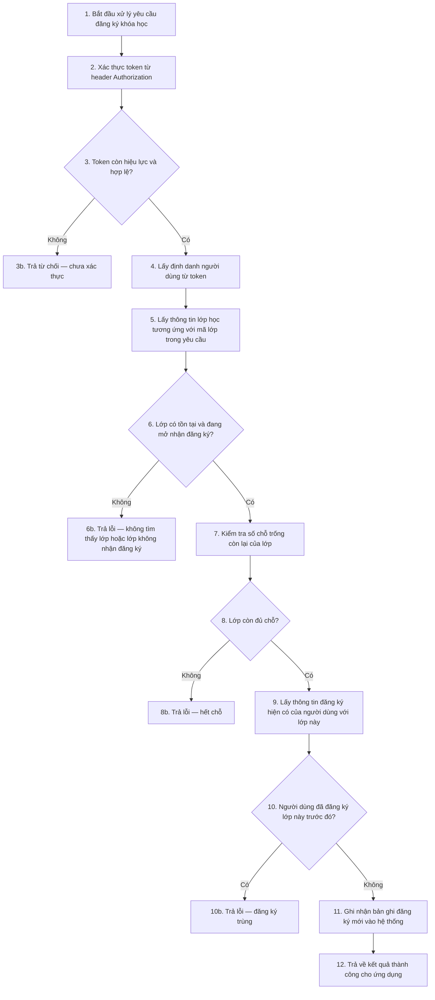

Version: 1.3.0  
Author: M2MBA  
Last Updated: 2026-04-10  
Description: Ví dụ output skill ba-activity-rule-spec (Mermaid ngôn ngữ nghiệp vụ + bảng SQL & lý do rule).

## Ghi chú định dạng (áp dụng mọi tài liệu sinh từ skill)

- **Một file cho toàn bộ API:** nếu có nhiều API, mỗi API một khối đặc tả rồi **ngay dưới** là Mermaid + bảng — **cùng một file**; ví dụ này chỉ minh họa **một** API.
- **Input là file Sequence:** chèn luồng + bảng **ngay sau mô tả từng API** trong `## Đặc tả API`, **không** tách một phần «phân tích validate» ở cuối file.
- **Cột SQL:** ví dụ dưới đây dùng tên bảng giả định — trong tài liệu thật, nếu có data model thì ghi **«SQL minh họa dựa trên data model đã cung cấp»**; nếu không có thì ghi **«SQL minh họa do suy đoán từ nghiệp vụ — chưa có data model chính thức»** (ở đầu phần phân tích hoặc trong ô tương ứng).

## Ví dụ: `POST /api/registrations` — Đăng ký khóa học

**Căn cứ SQL (ví dụ):** SQL minh họa do suy đoán từ nghiệp vụ — chưa gắn schema thực tế của dự án.

### Luồng Mermaid

Trong sơ đồ **không** ghi SQL, **không** giải thích «vì sao có rule» — chỉ dùng **ngôn ngữ nghiệp vụ**, **mỗi bước có số thứ tự** khớp với cột **Bước** ở bảng bên dưới.

### Bảng phân tích rule và thao tác

Số **Bước** khớp số trên các nút trong luồng (nhánh lỗi **3b, 6b, 8b, 10b** chỉ là kết quả của bước quyết định ngay trước, không cần thêm dòng nếu đã mô tả đủ ở bước đó).

| Bước | Mô tả bước | SQL tương ứng | Vì sao có rule đó |
|------|------------|---------------|-------------------|
| 1 | Tiếp nhận yêu cầu đăng ký theo nghiệp vụ đã mô tả | — | Khởi tạo ngữ cảnh xử lý (trace/log nếu có) |
| 2 | Đọc token từ header, giải mã và kiểm tra chữ ký, thời hạn | Không gói gọn một câu SELECT; xác thực bằng khóa/issuer theo cấu hình auth | Nhóm 2 + an toàn: xác định đúng chủ thể gọi API |
| 3 | Nếu token không hợp lệ — dừng (nhánh 3b: trả từ chối chưa xác thực) | — | Không cho thao tác khi chưa xác thực; cùng căn cứ bước 2 |
| 4 | Gắn yêu cầu với định danh người dùng lấy từ token | — | Liên kết thao tác với đúng người dùng, không tin `user_id` tự gửi nếu không khớp token |
| 5 | Tra cứu lớp học theo mã lớp trong yêu cầu | `SELECT * FROM classroom WHERE id = :classroom_id` | Nhóm 2: mã lớp phải tồn tại |
| 6 | Nếu không có lớp hoặc lớp không mở đăng ký — dừng (nhánh 6b) | — | Khớp nghiệp vụ «chỉ đăng ký khi lớp hợp lệ»; cùng căn cứ bước 5 |
| 7 | Đếm số lượng đăng ký hiện có của lớp để so với sĩ số tối đa | `SELECT COUNT(*) FROM enrollment WHERE classroom_id = :classroom_id` | Chuẩn bị kiểm tra còn chỗ (Nhóm 1, 3) |
| 8 | Nếu không còn chỗ — dừng (nhánh 8b) | — | Nhóm 1: quy tắc còn chỗ; Nhóm 3: số chỗ có thể đổi sau khi user xem màn hình |
| 9 | Kiểm tra đã tồn tại đăng ký cùng người dùng với cùng lớp | `SELECT 1 FROM enrollment WHERE user_id = :user_id AND classroom_id = :classroom_id` | Nhóm 5: phát hiện trùng trước khi ghi mới |
| 10 | Nếu đã đăng ký trước đó — dừng (nhánh 10b) | — | Nhóm 5: không trùng bản ghi đăng ký |
| 11 | Ghi nhận bản ghi đăng ký mới | `INSERT INTO enrollment (user_id, classroom_id, created_at) VALUES (...)` | Ghi nhận giao dịch sau khi mọi điều kiện đạt |
| 12 | Trả về kết quả thành công theo hợp đồng API | — | Chuẩn hóa phản hồi cho client |
