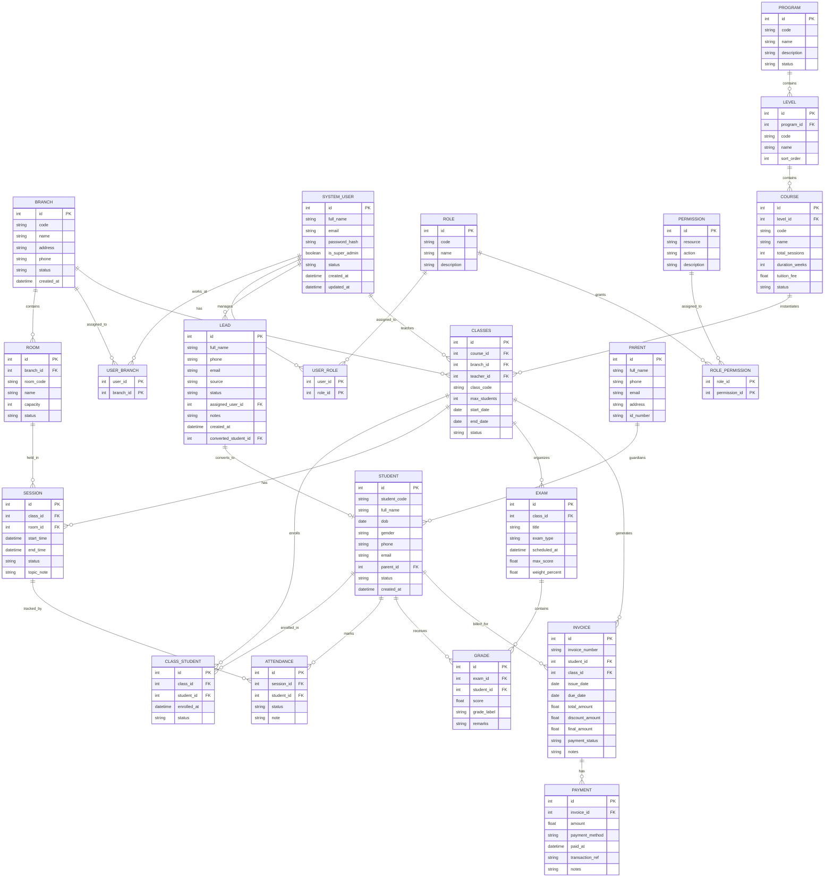
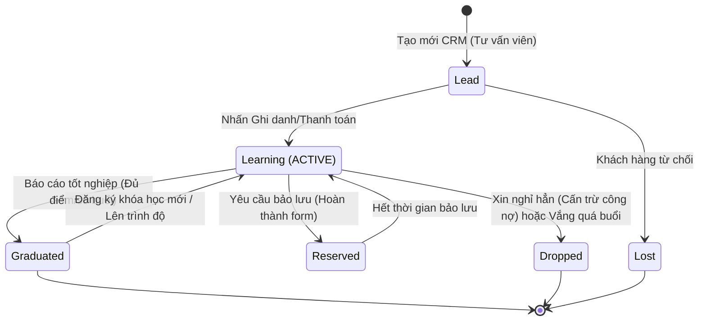

# ERD Document - Phần mềm Quản lý Đào tạo Trung tâm Tiếng Anh

**Version:** 1.2.0  
**Author:** BA (M2MBA)  
**Last Updated:** 2026-03-29  
**Description:** Entity-Relationship Diagram và Database Specification tổng thể cho hệ thống Quản lý Đào tạo Trung tâm Tiếng Anh, bổ sung Phân quyền RBAC. ERD Mermaid hiển thị đầy đủ thuộc tính theo từng thực thể; cú pháp Mermaid chuẩn (không dùng comment `%%` nội dòng trong khối quan hệ).

## 1. Overview
ERD này bao phủ các thực thể chính của toàn bộ 13 module vận hành bao gồm:
- Quản trị Hệ thống & Danh mục (BRANCH, ROOM, SYSTEM_USER, MÔ HÌNH RBAC)
- Quản lý Hồ sơ, Tuyển sinh (LEAD, STUDENT, PARENT)
- Quản lý Học thuật & Khóa học (PROGRAM, LEVEL, COURSE)
- Vận hành Lớp học (CLASSES, CLASS_STUDENT, SESSION, TEACHER qua SYSTEM_USER, ATTENDANCE, EXAM, GRADE)
- Tài chính Kế toán (INVOICE, PAYMENT)

## 2. Entity-Relationship Diagram (ERD)

> [!NOTE]  
> Sơ đồ ERD sử dụng Mermaid.js (`erDiagram`) với khối thuộc tính đầy đủ trên từng entity.

## 3. Data Dictionary

*Mô tả chi tiết các thực thể (Entities) và toàn bộ thuộc tính (Attributes).*

### 3.1. BRANCH (Chi nhánh)

| Attribute Name | Data Type | Key Type | Required | Description |
| :--- | :--- | :--- | :--- | :--- |
| `id` | int | PK | Yes | Khóa chính chi nhánh |
| `code` | string | UK | Yes | Mã chi nhánh (duy nhất toàn hệ thống) |
| `name` | string | | Yes | Tên hiển thị chi nhánh |
| `address` | string | | No | Địa chỉ |
| `phone` | string | | No | Số điện thoại liên hệ |
| `status` | string | | Yes | Trạng thái: ACTIVE, INACTIVE |
| `created_at` | datetime | | Yes | Thời điểm tạo bản ghi |

### 3.2. ROOM (Phòng học)

| Attribute Name | Data Type | Key Type | Required | Description |
| :--- | :--- | :--- | :--- | :--- |
| `id` | int | PK | Yes | Khóa chính phòng |
| `branch_id` | int | FK | Yes | Thuộc chi nhánh (`BRANCH.id`) |
| `room_code` | string | | Yes | Mã phòng (unique trong phạm vi chi nhánh — ràng buộc nghiệp vụ) |
| `name` | string | | No | Tên / nhãn phòng |
| `capacity` | int | | Yes | Sức chứa tối đa |
| `status` | string | | Yes | AVAILABLE, MAINTENANCE, INACTIVE |

### 3.3. SYSTEM_USER (Người dùng hệ thống)

- **Mô tả:** Tài khoản truy cập cho Admin, Quản lý, Nhân viên Học vụ, Giáo viên. Tách riêng bảng phụ để map branch và role.

| Attribute Name | Data Type | Key Type | Required | Description |
| :--- | :--- | :--- | :--- | :--- |
| `id` | int | PK | Yes | Khóa chính ID người dùng |
| `full_name` | string | | Yes | Họ và tên nhân sự |
| `email` | string | UK | Yes | Email liên hệ, đăng nhập |
| `password_hash` | string | | Yes | Mật khẩu truy cập (hash) |
| `is_super_admin` | boolean | | Yes | Cờ tài khoản root |
| `status` | string | | Yes | ACTIVE, INACTIVE |
| `created_at` | datetime | | Yes | Thời điểm tạo tài khoản |
| `updated_at` | datetime | | No | Thời điểm cập nhật gần nhất |

### 3.4. RBAC (Role-Based Access Control)

#### ROLE (Vai trò)

| Attribute Name | Data Type | Key Type | Required | Description |
| :--- | :--- | :--- | :--- | :--- |
| `id` | int | PK | Yes | Khóa chính vai trò |
| `code` | string | UK | Yes | Mã vai trò (ví dụ `TEACHER`, `MANAGER`) |
| `name` | string | | Yes | Tên hiển thị vai trò |
| `description` | string | | No | Mô tả vai trò |

#### PERMISSION (Quyền hạn)

| Attribute Name | Data Type | Key Type | Required | Description |
| :--- | :--- | :--- | :--- | :--- |
| `id` | int | PK | Yes | Khóa chính quyền |
| `resource` | string | | Yes | Tên chức năng/API (ví dụ `STUDENT`, `INVOICE`) |
| `action` | string | | Yes | Thao tác (`CREATE`, `READ`, `UPDATE`, `DELETE`) |
| `description` | string | | No | Giải thích quyền |

#### ROLE_PERMISSION (Map quyền — vai trò)

| Attribute Name | Data Type | Key Type | Required | Description |
| :--- | :--- | :--- | :--- | :--- |
| `role_id` | int | PK, FK | Yes | `ROLE.id` |
| `permission_id` | int | PK, FK | Yes | `PERMISSION.id` |

#### USER_ROLE (Map user — vai trò)

| Attribute Name | Data Type | Key Type | Required | Description |
| :--- | :--- | :--- | :--- | :--- |
| `user_id` | int | PK, FK | Yes | `SYSTEM_USER.id` |
| `role_id` | int | PK, FK | Yes | `ROLE.id` |

#### USER_BRANCH (Map user — chi nhánh làm việc)

| Attribute Name | Data Type | Key Type | Required | Description |
| :--- | :--- | :--- | :--- | :--- |
| `user_id` | int | PK, FK | Yes | `SYSTEM_USER.id` |
| `branch_id` | int | PK, FK | Yes | `BRANCH.id` (một nhân sự có thể gắn nhiều chi nhánh) |

### 3.5. LEAD (Khách hàng tiềm năng / CRM)

| Attribute Name | Data Type | Key Type | Required | Description |
| :--- | :--- | :--- | :--- | :--- |
| `id` | int | PK | Yes | Khóa chính lead |
| `full_name` | string | | Yes | Họ tên khách |
| `phone` | string | | Yes | Số điện thoại |
| `email` | string | | No | Email |
| `source` | string | | No | Nguồn (website, giới thiệu, walk-in, …) |
| `status` | string | | Yes | NEW, CONTACTED, CONVERTED, LOST, … |
| `assigned_user_id` | int | FK | No | Nhân viên phụ trách (`SYSTEM_USER.id`) |
| `notes` | string | | No | Ghi chú tư vấn |
| `created_at` | datetime | | Yes | Thời điểm tạo lead |
| `converted_student_id` | int | FK | No | Học viên sau chuyển đổi (`STUDENT.id`), null nếu chưa convert |

### 3.6. PARENT (Phụ huynh / Người giám hộ)

| Attribute Name | Data Type | Key Type | Required | Description |
| :--- | :--- | :--- | :--- | :--- |
| `id` | int | PK | Yes | Khóa chính |
| `full_name` | string | | Yes | Họ tên |
| `phone` | string | | Yes | Liên hệ chính |
| `email` | string | | No | Email |
| `address` | string | | No | Địa chỉ |
| `id_number` | string | | No | CMND/CCCD (nếu cần hợp đồng/hóa đơn) |

### 3.7. STUDENT (Học viên)

| Attribute Name | Data Type | Key Type | Required | Description |
| :--- | :--- | :--- | :--- | :--- |
| `id` | int | PK | Yes | Khóa chính học viên |
| `student_code` | string | UK | Yes | Mã học viên |
| `full_name` | string | | Yes | Tên học viên |
| `dob` | date | | Yes | Ngày sinh |
| `gender` | string | | No | MALE, FEMALE, OTHER |
| `phone` | string | | No | Số điện thoại học viên |
| `email` | string | | No | Email |
| `parent_id` | int | FK | Yes | Người giám hộ / thanh toán (`PARENT.id`) |
| `status` | string | | Yes | ACTIVE, RESERVED, DROPPED, … |
| `created_at` | datetime | | Yes | Ngày tạo hồ sơ |

### 3.8. PROGRAM (Chương trình đào tạo)

| Attribute Name | Data Type | Key Type | Required | Description |
| :--- | :--- | :--- | :--- | :--- |
| `id` | int | PK | Yes | Khóa chính |
| `code` | string | UK | Yes | Mã chương trình |
| `name` | string | | Yes | Tên chương trình |
| `description` | string | | No | Mô tả |
| `status` | string | | Yes | ACTIVE, INACTIVE |

### 3.9. LEVEL (Cấp độ / Trình độ trong chương trình)

| Attribute Name | Data Type | Key Type | Required | Description |
| :--- | :--- | :--- | :--- | :--- |
| `id` | int | PK | Yes | Khóa chính |
| `program_id` | int | FK | Yes | Thuộc chương trình (`PROGRAM.id`) |
| `code` | string | | Yes | Mã cấp độ (trong phạm vi program nên unique) |
| `name` | string | | Yes | Tên hiển thị (A1, B2, …) |
| `sort_order` | int | | Yes | Thứ tự sắp xếp |

### 3.10. COURSE (Khóa học / Giáo trình)

| Attribute Name | Data Type | Key Type | Required | Description |
| :--- | :--- | :--- | :--- | :--- |
| `id` | int | PK | Yes | Khóa chính |
| `level_id` | int | FK | Yes | Thuộc cấp độ (`LEVEL.id`) |
| `code` | string | UK | Yes | Mã khóa học |
| `name` | string | | Yes | Tên khóa |
| `total_sessions` | int | | Yes | Tổng số buổi quy định |
| `duration_weeks` | int | | No | Thời lượng ước tính (tuần) |
| `tuition_fee` | decimal | | No | Học phí tham chiếu (một giá) |
| `status` | string | | Yes | ACTIVE, INACTIVE |

### 3.11. CLASSES (Lớp học)

| Attribute Name | Data Type | Key Type | Required | Description |
| :--- | :--- | :--- | :--- | :--- |
| `id` | int | PK | Yes | ID lớp học |
| `course_id` | int | FK | Yes | Giáo trình (`COURSE.id`) |
| `branch_id` | int | FK | Yes | Chi nhánh tổ chức (`BRANCH.id`) |
| `teacher_id` | int | FK | Yes | Giáo viên chủ nhiệm (`SYSTEM_USER.id`) |
| `class_code` | string | UK | Yes | Mã lớp |
| `max_students` | int | | Yes | Sĩ số tối đa |
| `start_date` | date | | Yes | Ngày khai giảng / bắt đầu |
| `end_date` | date | | No | Ngày kết thúc dự kiến |
| `status` | string | | Yes | PLANNED, ACTIVE, COMPLETED, CANCELLED |

### 3.12. CLASS_STUDENT (Ghi danh lớp — bảng trung gian)

| Attribute Name | Data Type | Key Type | Required | Description |
| :--- | :--- | :--- | :--- | :--- |
| `id` | int | PK | Yes | Khóa surrogate |
| `class_id` | int | FK | Yes | `CLASSES.id` |
| `student_id` | int | FK | Yes | `STUDENT.id` |
| `enrolled_at` | datetime | | Yes | Thời điểm ghi danh |
| `status` | string | | Yes | ACTIVE, COMPLETED, DROPPED, TRANSFERRED |
| *Ràng buộc* | | | | Unique (`class_id`, `student_id`) theo từng khóa học lớp đang hiệu lực (nghiệp vụ) |

### 3.13. SESSION (Buổi học / Lịch học)

| Attribute Name | Data Type | Key Type | Required | Description |
| :--- | :--- | :--- | :--- | :--- |
| `id` | int | PK | Yes | Khóa chính |
| `class_id` | int | FK | Yes | Thuộc lớp (`CLASSES.id`) |
| `room_id` | int | FK | Yes | Phòng (`ROOM.id`) |
| `start_time` | datetime | | Yes | Bắt đầu |
| `end_time` | datetime | | Yes | Kết thúc |
| `status` | string | | Yes | NORMAL, RESCHEDULED, CANCELLED |
| `topic_note` | string | | No | Nội dung / chủ đề buổi học |

### 3.14. ATTENDANCE (Điểm danh)

| Attribute Name | Data Type | Key Type | Required | Description |
| :--- | :--- | :--- | :--- | :--- |
| `id` | int | PK | Yes | Khóa chính |
| `session_id` | int | FK | Yes | Buổi học (`SESSION.id`) |
| `student_id` | int | FK | Yes | Học viên (`STUDENT.id`) |
| `status` | string | | Yes | PRESENT, ABSENT_EXCUSED, ABSENT_UNEXCUSED |
| `note` | string | | No | Ghi chú (phép, lý do) |

### 3.15. EXAM (Kỳ kiểm tra / Bài thi lớp)

| Attribute Name | Data Type | Key Type | Required | Description |
| :--- | :--- | :--- | :--- | :--- |
| `id` | int | PK | Yes | Khóa chính |
| `class_id` | int | FK | Yes | Lớp tổ chức (`CLASSES.id`) |
| `title` | string | | Yes | Tiêu đề kỳ thi |
| `exam_type` | string | | No | MIDTERM, FINAL, QUIZ, … |
| `scheduled_at` | datetime | | Yes | Thời điểm diễn ra |
| `max_score` | decimal | | Yes | Điểm tối đa |
| `weight_percent` | decimal | | No | Trọng số % vào tổng kết (nếu áp dụng) |

### 3.16. GRADE (Điểm số theo kỳ thi)

| Attribute Name | Data Type | Key Type | Required | Description |
| :--- | :--- | :--- | :--- | :--- |
| `id` | int | PK | Yes | Khóa chính |
| `exam_id` | int | FK | Yes | `EXAM.id` |
| `student_id` | int | FK | Yes | `STUDENT.id` |
| `score` | decimal | | Yes | Điểm đạt được |
| `grade_label` | string | | No | Nhãn điểm (A, B, …) |
| `remarks` | string | | No | Nhận xét |

### 3.17. INVOICE (Hóa đơn)

| Attribute Name | Data Type | Key Type | Required | Description |
| :--- | :--- | :--- | :--- | :--- |
| `id` | int | PK | Yes | Khóa chính |
| `invoice_number` | string | UK | Yes | Số hóa đơn hiển thị / in |
| `student_id` | int | FK | Yes | Thu của học viên (`STUDENT.id`) |
| `class_id` | int | FK | No | Gắn với lớp phát sinh công nợ (`CLASSES.id`), null nếu khoản thu khác |
| `issue_date` | date | | Yes | Ngày phát hành |
| `due_date` | date | | No | Hạn thanh toán |
| `total_amount` | decimal | | Yes | Tổng tiền gốc |
| `discount_amount` | decimal | | No | Giảm giá / học bổng |
| `final_amount` | decimal | | Yes | Số phải thu thực tế |
| `payment_status` | string | | Yes | PENDING, PARTIAL, COMPLETED |
| `notes` | string | | No | Ghi chú hóa đơn |

### 3.18. PAYMENT (Thanh toán)

| Attribute Name | Data Type | Key Type | Required | Description |
| :--- | :--- | :--- | :--- | :--- |
| `id` | int | PK | Yes | Khóa chính |
| `invoice_id` | int | FK | Yes | `INVOICE.id` |
| `amount` | decimal | | Yes | Số tiền thanh toán đợt này |
| `payment_method` | string | | Yes | CASH, BANK_TRANSFER, CARD, E_WALLET, … |
| `paid_at` | datetime | | Yes | Thời điểm ghi nhận |
| `transaction_ref` | string | | No | Mã giao dịch / biên lai |
| `notes` | string | | No | Ghi chú |

## 4. Relationships Specification

| Entity A | Relation | Entity B | Cardinality | Description / Business Rule |
| :--- | :--- | :--- | :--- | :--- |
| **BRANCH** | **contains** | **ROOM** | **1:N** | Một chi nhánh có nhiều phòng học. |
| **SYSTEM_USER** | **has** | **USER_ROLE** | **1:N** | Một người dùng có thể kiêm nhiều vai trò. |
| **ROLE** | **grants** | **ROLE_PERMISSION** | **1:N** | Một vai trò gom nhiều quyền CRUD. |
| **SYSTEM_USER** | **works_at** | **USER_BRANCH** | **1:N** | Nhân sự có thể làm việc ở nhiều chi nhánh. |
| **LEAD** | **converts_to** | **STUDENT** | **0..1:1** | Một lead chuyển tối đa một học viên. |
| **PARENT** | **guardians** | **STUDENT** | **1:N** | Một phụ huynh có thể liên kết nhiều học viên. |
| **PROGRAM** | **contains** | **LEVEL** | **1:N** | Phân cấp trong chương trình. |
| **LEVEL** | **contains** | **COURSE** | **1:N** | Mỗi cấp có nhiều khóa học. |
| **COURSE** | **instantiates** | **CLASSES** | **1:N** | Một khóa học mở nhiều lớp theo thời gian/chi nhánh. |
| **CLASSES** | **enrolls** | **CLASS_STUDENT** | **1:N** | Ghi danh nhiều học viên qua bảng trung gian. |
| **STUDENT** | **enrolled_in** | **CLASS_STUDENT** | **1:N** | Học viên có thể tham gia nhiều lớp. |
| **CLASSES** | **has** | **SESSION** | **1:N** | Lớp có nhiều buổi học theo lịch. |
| **INVOICE** | **has** | **PAYMENT** | **1:N** | Một hóa đơn có thể thanh toán nhiều đợt. |

## 5. State Diagram

> [!NOTE]  
> Sơ đồ trạng thái vòng đời từ khách hàng tiềm năng đến kết thúc khóa học.

### 5.1. State Machine: Vòng đời Học viên (STUDENT LIFECYCLE)

**State Transitions Table:**

| Nguồn (From State) | Đích (To State) | Tác nhân (Actor) | Hành động (Action) | Điều kiện (Condition) |
| :--- | :--- | :--- | :--- | :--- |
| `Lead` | `Learning` | Nhân viên học vụ | Xác nhận thanh toán & Đăng ký | INVOICE status phải là PARTIAL hoặc COMPLETED |
| `Learning` | `Reserved` | Quản lý Đào tạo | Xác nhận đơn bảo lưu | Không còn công nợ cũ, được nghỉ bảo lưu |
| `Learning` | `Dropped` | Hệ thống (Cron) | Tự động báo động Hủy tư cách | Vắng mặt quá X buổi học liên tiếp không xin phép |
