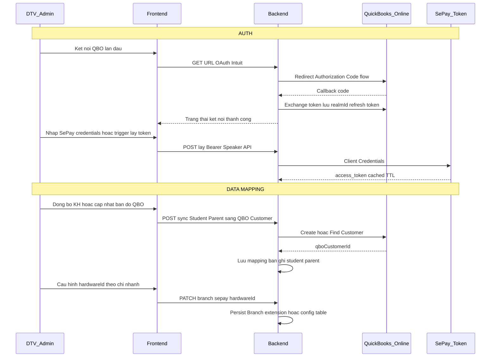
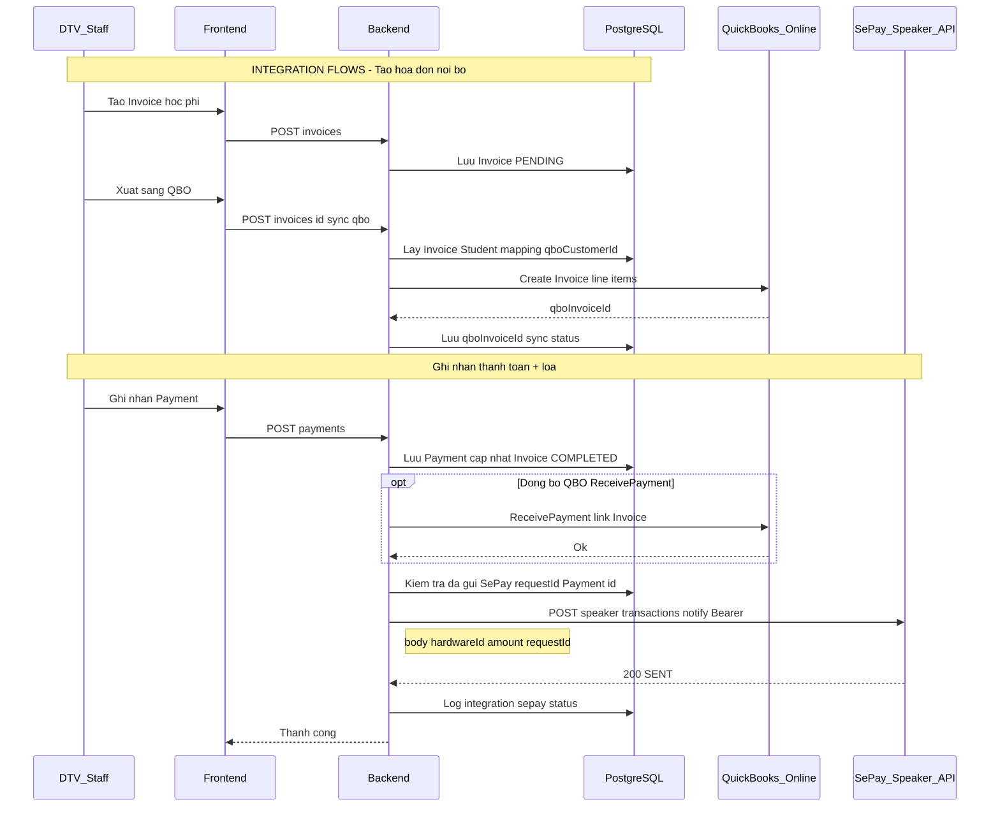

# Tích hợp QuickBooks Online (QBO) & SePay Speaker API — Đặc tả BA

**Phiên bản tài liệu:** 1.0  
**Ngày:** 2026-04-07  
**Hệ thống nội bộ:** DreamHigh PMS (`pms-eng-api` + Prisma / PostgreSQL)  
**Đối tác:** **Intuit QuickBooks Online** (xuất hóa đơn kế toán) + **SePay** (API loa SoundBox — thông báo biến động số dư)  
**Loại tích hợp:** **Hybrid — REST API** (hai đối tác độc lập, có thể bật/tắt theo cấu hình chi nhánh).

**Tham chiếu đối tác:**

- QBO: [Intuit Developer](https://developer.intuit.com/) — OAuth 2.0, QuickBooks Online API (Invoice, Customer, Item…).
- SePay Speaker: [API Thông báo biến động số dư](https://developer.sepay.vn/vi/speaker-api/api-thong-bao-bien-dong-so-du) — Base URL `https://speaker-api.sepay.vn/devices/v1`, endpoint `POST .../speaker/transactions/notify`.

**⚠️ Lưu ý phạm vi:** URL bạn cung cấp là API **thiết bị loa (SoundBox)** — phát âm thanh số tiền khi có biến động. Đây **không** phải API VA/ngân hàng tự động đối soát chuyển khoản (Webhook Sepay khác). Nếu sau này cần **đối soát VA**, cần bổ sung tài liệu Webhook/Casso tương ứng — đánh dấu **Giả định / mở rộng**.

**Tham chiếu schema nội bộ:** `pms-eng-api/prisma/schema.prisma` — chủ yếu `Invoice`, `Payment`, `Student`, `Parent`, `TrainingClass`; mở rộng đề xuất ở mục **G**.

---

## A. Tổng quan & mục đích tích hợp

| Mục tiêu | Mô tả |
|----------|--------|
| **QBO** | Đồng bộ **hóa đơn học phí** (và có thể **khách hàng** tương ứng học viên/phụ huynh) sang QuickBooks Online để kế toán xuất hóa đơn, báo cáo doanh thu, đối chiếu theo kỳ. |
| **SePay Speaker** | Khi hệ thống ghi nhận **thanh toán** (hoặc số tiền cần thông báo tại quầy), gọi API để **loa đọc số tiền** (VND), hỗ trợ minh bạch tại chi nhánh. |

**Ràng buộc chung (Giả định cần confirm):**

- Một **chi nhánh** có thể có **một `hardwareId`** loa; hoặc nhiều quầy → nhiều thiết bị → cấu hình theo `Branch` / quầy.
- **Idempotency:** SePay yêu cầu `requestId` duy nhất mỗi lần gửi — map từ `Payment.id` hoặc UUID nội bộ.
- QBO: môi trường **Sandbox** vs **Production**; refresh token lưu an toàn (vault / DB mã hóa).

---

## B. Luồng tích hợp tổng thể (pseudo flow)

### Pha chung

1. **[AUTH]**
   - **QBO:** OAuth 2.0 (Intuit) — lấy `access_token`, `refresh_token`, `realmId` (company); lưu theo tenant / công ty.
   - **SePay Speaker:** Client Credentials → `Bearer` token (theo luồng tài liệu SePay: tạo token trước khi gọi `transactions/notify`).
2. **[DATA MAPPING]**
   - Map **Student / Parent** ↔ **QBO Customer** (lưu `qboCustomerId`).
   - Map **sản phẩm/dịch vụ học phí** ↔ **QBO Item hoặc Account** (lưu `qboItemId` hoặc account ref) — *Giả định: có bảng danh mục map hoặc cấu hình tĩnh theo khóa học*.
   - Map **Branch** ↔ **SePay `hardwareId`** (serial thiết bị đã pair).
   - Hoàn tất **pair/check** cho loa theo quy trình SePay (OTP…) — có thể thực hiện ngoài PMS lần đầu, PMS chỉ lưu `hardwareId`.
3. **[INTEGRATION FLOWS]**
   - **Tạo / chốt hóa đơn nội bộ** (`Invoice` PENDING → xuất kế toán): tạo **QBO Invoice** (hoặc SalesReceipt tùy chính sách), lưu `qboInvoiceId`, trạng thái đồng bộ.
   - **Ghi nhận thanh toán** (`Payment`): cập nhật QBO (ReceivePayment / liên kết Invoice) *nếu áp dụng*; đồng thời hoặc sau đó gọi **SePay `transactions/notify`** với `amount` (VND nguyên), `hardwareId`, `requestId`.
   - **Retry / log:** mọi lỗi ghi `integration_log` (đề xuất), retry có backoff, không gửi trùng `requestId` cho SePay.

---

## C. Sequence diagram (Mermaid)

### C1. OAuth & master data (tổng quan)



### C2. Xuất hóa đơn QBO + thông báo loa SePay khi thanh toán



---

## D. Đặc tả kỹ thuật (REST)

### D.1 QuickBooks Online (rút gọn — chi tiết theo Intuit doc)

| Thành phần | Mô tả |
|------------|--------|
| **Auth** | OAuth 2.0 Authorization Code; `realmId`; refresh token rotation. |
| **Base URL** | `https://quickbooks.api.intuit.com/v3/company/{realmId}/` (production) / sandbox tương đương. |
| **Entity chính** | Customer, Invoice, Item (hoặc Service), Payment receive — *theo chính sách kế toán*. |

**Giả định:** Chọn **Invoice + ReceivePayment** hoặc chỉ **Invoice** khi chưa thu tiền; cần **kế toán / BA** xác nhận.

### D.2 SePay Speaker — `POST /devices/v1/speaker/transactions/notify`

**Nguồn:** [developer.sepay.vn — API thông báo biến động số dư](https://developer.sepay.vn/vi/speaker-api/api-thong-bao-bien-dong-so-du)

| Thuộc tính | Giá trị |
|------------|---------|
| **Method** | POST |
| **URL đầy đủ** | `https://speaker-api.sepay.vn/devices/v1/speaker/transactions/notify` |
| **Header** | `Authorization: Bearer <token>`, `Content-Type: application/json` |
| **Body** | `hardwareId` (string), `amount` (number VND), `requestId` (string, **unique**, idempotency) |

**Response mẫu (thành công):**

```json
{
  "code": 200,
  "message": "Đã gửi thông báo thành công",
  "data": {
    "hardwareId": "VNS52508000001",
    "requestId": "TXN202510130001",
    "status": "SENT"
  }
}
```

**Điều kiện:** Thiết bị đã **pair**, **online**; tuân thủ luồng token + pair trong tài liệu SePay (check/request/verify OTP).

---

## D'. Bảng mapping đầu vào (cấu hình & nguồn UI/process)

| Field / tham số | Đối tác | IN | Source (PMS) | Required | Rule / Default | Ghi chú |
|-----------------|---------|-----|--------------|----------|----------------|--------|
| realmId | QBO | IN | OAuth callback | Yes | — | Lưu per kết nối QBO |
| qboCustomerId | QBO | IN | Mapping sau sync Customer | Yes (khi tạo Invoice) | Lazy create | Student / Parent |
| Line Item / ItemRef | QBO | IN | Cấu hình khóa học / hạch toán | **Giả định** | Theo Program/Course | BA + KT |
| hardwareId | SePay | IN | Cấu hình Branch / quầy | Yes khi bật loa | — | Serial thiết bị |
| Bearer token | SePay | IN | Client credentials cache | Yes | TTL theo SePay | Không log full token |
| amount | SePay | IN | `Payment.amount` | Yes | Số nguyên VND | Làm tròn theo nghiệp vụ |
| requestId | SePay | IN | `pay-${Payment.id}` hoặc UUID | Yes | Unique | Idempotency |

---

## E. Bảng mapping đầu ra → model Prisma hiện có & mở rộng đề xuất

### E.1 Trường có trong schema hiện tại (sử dụng trực tiếp)

| Entity Prisma | Field | Purpose trong tích hợp |
|---------------|-------|-------------------------|
| `Invoice` | `invoiceNumber`, `issueDate`, `finalAmount`, `paymentStatus`, `studentId`, `classId` | Nguồn tạo QBO Invoice; trạng thái thanh toán |
| `Payment` | `amount`, `paidAt`, `paymentMethod`, `transactionRef`, `invoiceId` | Nguồn `amount` cho SePay; `requestId` suy ra từ `id` / ref |
| `Student` | `fullName`, `studentCode`, `parentId` | Map Customer QBO; hiển thị trên chứng từ |
| `Parent` | `fullName`, `phone`, `email` | Thông tin Customer QBO (phụ huynh) |

### E.2 **Chưa có trong schema** — đề xuất bổ sung (Persist?)

| Field / bảng đề xuất | Persist? | Purpose |
|----------------------|----------|---------|
| `Invoice.qboInvoiceId` / `Invoice.qboSyncStatus` / `Invoice.qboLastError` | Yes | Theo dõi đồng bộ QBO |
| `Student.qboCustomerId` hoặc `Parent.qboCustomerId` | Yes | Idempotency tạo KH QBO |
| `Branch.sepayHardwareId` hoặc bảng `BranchPaymentDevice` | Yes | Map loa theo chi nhánh |
| `IntegrationOutboundLog` (partner, operation, payloadHash, status, response) | Yes | Audit, retry, đối soát |
| `SePayNotification` (`paymentId`, `requestId`, `status`, `sentAt`) | Yes | Tránh gửi trùng, tra cứu |

**Giả định:** Migration Prisma do team kỹ thuật thực hiện sau khi BA/KT duyệt.

---

## F. Use Case & màn hình / chức năng cần có

| Tên chức năng | Loại | API / hành động đối tác | Dữ liệu |
|---------------|------|---------------------------|---------|
| Kết nối QuickBooks (OAuth) | Cấu hình | Intuit OAuth | realmId, token |
| Ngắt kết nối / xoay refresh token | Cấu hình | Intuit | — |
| Đồng bộ khách hàng lên QBO | Gọi API nội bộ → QBO | Create/Update Customer | Student, Parent |
| Xuất hóa đơn kế toán (từ Invoice) | Gọi API | QBO Create Invoice | Invoice lines |
| Ghi nhận thanh toán (đã có) + tùy chọn đẩy QBO | Gọi API | QBO ReceivePayment | Payment |
| Cấu hình thiết bị loa SePay (`hardwareId`) | Cấu hình | — | Branch |
| Gửi thông báo loa khi thu tiền | Process + REST | SePay `transactions/notify` | Payment |
| Nhật ký tích hợp / retry | Process nội bộ | — | Log table |
| (Tuỳ chọn) Bật/tắt loa theo chi nhánh | Cấu hình | — | Feature flag |

---

## G. ERD mở rộng (Mermaid — khái niệm)

```mermaid
erDiagram
    Invoice ||--o{ Payment : has
    Invoice }o--|| Student : billed_to
    Student }o--|| Parent : guardian
    Invoice ||--o| QboInvoiceLink : "de xuat"
    Student ||--o| QboCustomerLink : "de xuat"
    Payment ||--o| SepayNotifyLog : "de xuat"
    Branch ||--o| SepayDevice : "de xuat"

    QboInvoiceLink {
        int invoiceId PK_FK
        string qboInvoiceId
        string syncStatus
    }
    QboCustomerLink {
        int studentId PK_FK
        string qboCustomerId
    }
    SepayNotifyLog {
        int paymentId PK_FK
        string requestId UK
        string status
        datetime sentAt
    }
    SepayDevice {
        int branchId PK_FK
        string hardwareId
    }
```

*(Đây là mô hình **đề xuất**; đặt tên bảng/thực thể cuối cùng theo chuẩn team.)*

---

## H. Checklist BA / Go-live

- [ ] Xác nhận **phạm vi QBO**: chỉ xuất Invoice hay cả **hóa đơn GTGT** (VAT) — quy trình pháp lý VN vs QBO Global.
- [ ] Xác nhận **Customer** map theo **Học viên** hay **Phụ huynh** (thanh toán).
- [ ] Xác nhận **Item/Account** revenue trên QBO cho từng loại học phí.
- [ ] SePay: Hoàn tất **pair thiết bị**, lưu `hardwareId`; thống nhất **requestId** format.
- [ ] Xử lý **lỗi loa offline** — có retry? có thông báo UI cho thu ngân?
- [ ] **Bảo mật:** secret QBO & SePay trong env / vault; không log PII/chứng từ đầy đủ trong plaintext.
- [ ] **UAT:** Sandbox QBO + thiết bị SePay test.
- [ ] **Runbook:** revoke token, đổi thiết bị, đối soát `Payment` vs log SePay.

---

## Bước 10 — Câu hỏi elicitation (trích)

| Mức | Câu hỏi |
|-----|---------|
| 🔴 | Có cần tích hợp **Webhooks ngân hàng / VA SePay** (đối soát tự động) song song với **Speaker API**, hay chỉ loa tại quầy? |
| 🔴 | Một **Payment** chia làm nhiều lần thu — gọi SePay **mỗi lần** hay chỉ tổng phiên? |
| 🟡 | QBO: **một company** cho toàn hệ thống hay **mỗi chi nhánh** một kết nối? |
| 🟡 | Số tiền SePay: dùng **`finalAmount` Invoice** hay **từng `Payment.amount`**? |
| 🟡 | Có cần đồng bộ **hoàn tiền / điều chỉnh** sang QBO khi hủy hóa đơn nội bộ? |

---

*Tài liệu sinh theo skill `.agent/skills/ba-integration-spec/SKILL.md` — đầy đủ khối A→H; các mục đánh **Giả định** cần workshop với Kế toán + Kỹ thuật + SePay/Intuit.*
