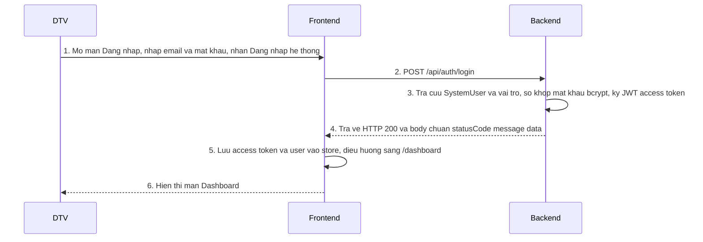

# Sequence — Đăng nhập hệ thống

**Tên chức năng:** Đăng nhập (email + mật khẩu **hoặc** Google)  
**Mô tả:** Người dùng mở màn đăng nhập, xác thực bằng email/mật khẩu hoặc nút Google; nhận JWT và hồ sơ user (kèm `roles`), FE lưu phiên và chuyển tới Dashboard.  
**Tham chiếu kỹ thuật:** `dreamhigh-web` (React, Zustand persist, `@react-oauth/google`), `pms-eng-api` (NestJS, Prisma, JWT, bcrypt, `google-auth-library`).  
**Đối tác thứ ba:** **Google** — luồng tùy chọn khi đã cấu hình `VITE_GOOGLE_CLIENT_ID` (FE) và `GOOGLE_CLIENT_ID` (BE).

---

## Sequence Diagram

### Luồng A — Đăng nhập email / mật khẩu (happy path)



### Luồng B — Đăng nhập Google (happy path)

```mermaid
sequenceDiagram
    participant User as DTV
    participant FE as Frontend
    participant Google as Google_OAuth
    participant BE as Backend

    User->>FE: 1. Mo man Dang nhap, chon Dang nhap bang Google
    FE->>Google: 2. Hien thuc Sign in with Google (credential)
    Google-->>FE: 3. Tra ve id token (JWT Google)
    FE->>BE: 4. POST /api/auth/google { idToken }
    BE->>BE: 5. Xac minh id token voi GOOGLE_CLIENT_ID, doc sub email name
    BE->>BE: 6. Tim SystemUser theo google_sub hoac email; neu chua co thi tao user + role STUDENT; neu co email local thi gan google_sub
    BE-->>FE: 7. Tra ve HTTP 200 JWT he thong va user cong khai
    FE->>FE: 8. Luu token va user, dieu huong /dashboard
    FE-->>User: 9. Hien thi man Dashboard
```

---

## Đặc tả API

### API: Đăng nhập (email / mật khẩu)

**Thông tin cơ bản:**
- **Tên API:** Đăng nhập
- **Mục đích:** Xác thực người dùng theo email/mật khẩu, cấp JWT và trả thông tin user công khai (có `roles`).
- **Method:** `POST`
- **Endpoint:** `/api/auth/login`

**Request Data:**

| Field | Type | Description | Required | Example |
|-------|------|-------------|----------|---------|
| email | string | Email đăng nhập | Yes | user@example.com |
| password | string | Mật khẩu plain text (HTTPS) | Yes | (không log) |

**Response Data (HTTP 200):** như bảng dưới (chuẩn `statusCode`, `message`, `data.accessToken`, `data.user`, `meta`).

**Các trường hợp lỗi (tóm tắt):**
- **400 Bad Request:** DTO không hợp lệ.
- **401 Unauthorized:** Sai email/mật khẩu; tài khoản không ACTIVE; **hoặc** tài khoản chỉ có Google (`password_hash` null) — BE yêu cầu dùng đăng nhập Google.
- **500:** Lỗi hệ thống.

---

### API: Đăng nhập Google

**Thông tin cơ bản:**
- **Tên API:** Đăng nhập Google (credential)
- **Mục đích:** Nhận `id_token` do Google cấp sau khi user đăng nhập; BE xác minh token, đồng bộ/`SystemUser` (tạo mới hoặc liên kết `google_sub`), cấp **cùng định dạng JWT nội bộ** như `/login`.
- **Method:** `POST`
- **Endpoint:** `/api/auth/google`

**Request Data:**

| Field | Type | Description | Required | Example |
|-------|------|-------------|----------|---------|
| idToken | string | `credential` từ Google Identity Services | Yes | eyJhbGciOi... |

**Response Data (HTTP 200):** Cùng cấu trúc body chuẩn: `data.accessToken`, `data.user` (không `passwordHash`, không lộ `googleSub`), `roles[]`.

**Các trường hợp lỗi (tóm tắt):**
- **400:** Thiếu/invalid DTO; **hoặc** `GOOGLE_CLIENT_ID` chưa cấu hình trên BE.
- **401:** Token Google không hợp lệ/hết hạn; email Google chưa verified; tài khoản khóa; xung đột liên kết Google khác với cùng email.
- **500:** Lỗi hệ thống.

**Status Code (gộp hai API đăng nhập):**

| Code | Meaning | Mô tả |
|------|---------|--------|
| 200 | OK | Có `data.accessToken` và `data.user` |
| 400 | Bad Request | Payload / cấu hình |
| 401 | Unauthorized | Xác thực thất bại |
| 500 | Internal Server Error | Lỗi server |

---

## Ghi chú triển khai FE / vận hành

- **Email/mật khẩu:** `apiClient` → `POST /auth/login` (dev: proxy `/api`).
- **Google:** Bọc app bằng `GoogleOAuthProvider` khi có `VITE_GOOGLE_CLIENT_ID`; widget gọi `POST /auth/google` với `{ idToken }`.
- Sau 200: `useAuthStore.login(user, accessToken)` và `navigate('/dashboard')`.
- **Google Cloud:** Web client — Authorized JavaScript origins: `http://localhost:5175` (và origin production). `GOOGLE_CLIENT_ID` (BE) = `VITE_GOOGLE_CLIENT_ID` (FE).
- Lỗi mạng: FE hiển thị gợi ý kiểm tra backend.

---

*Skill tham chiếu:* `.agent/skills/ba-sequence-spec/SKILL.md`  
*Preview Mermaid:* trong VS Code / Cursor dùng preview Markdown.
