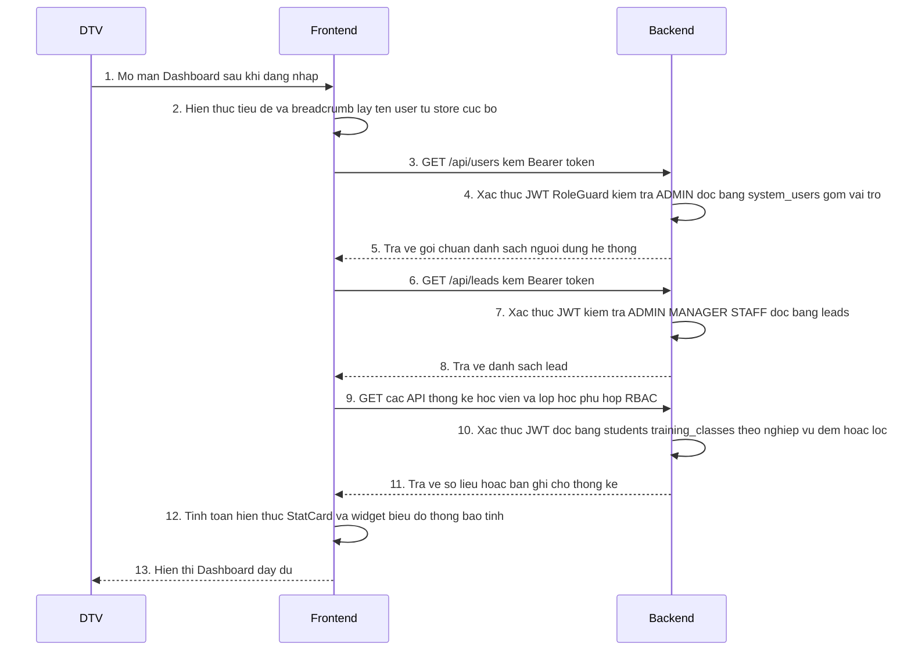

# Sequence — Dashboard (tổng quan vận hành)

**Tên chức năng:** Dashboard  
**Mô tả:** Người dùng đã đăng nhập mở màn tổng quan: xem lời chào, các chỉ số vận hành (người dùng hệ thống, lead, lớp học, học viên — theo quyền), cùng các khối thông tin tĩnh / mock trên FE.  
**Tham chiếu kỹ thuật:** `dreamhigh-web` (`DashboardPage.tsx`, React Query, `apiClient` + JWT), `pms-eng-api` (NestJS, Prisma, guards JWT + RBAC).  
**Tham chiếu thực thể (DB):** `SystemUser`, `Lead`, `Student`, `TrainingClass` — `prisma/schema.prisma`.  
**Đối tác thứ ba:** **Không áp dụng** (chỉ Actor — FE — BE).

---

## Sequence Diagram

Luồng **thành công** khi user có đủ quyền gọi các API thống kê; không mô tả validate chi tiết. Các bước lấy dữ liệu song song được thể hiện tuần tự trong diagram (cùng phiên tải trang).

---

## Đặc tả API

### API: Lấy danh sách người dùng hệ thống

**Thông tin cơ bản:**
- **Tên API:** Liệt kê SystemUser (admin)
- **Mục đích:** Phục vụ quản trị / tổng quan số tài khoản nội bộ; map `system_users` + quan hệ `user_roles` → `roles[]`.
- **Method:** `GET`
- **Endpoint:** `/api/users`
- **Auth / RBAC:** JWT bắt buộc; role **ADMIN**.

**Request Data:** Không body; header `Authorization: Bearer <token>`.

**Response Data (chuẩn đề xuất):**

| Field | Type | Description | Example |
|-------|------|-------------|---------|
| statusCode | number | 200 | 200 |
| message | string | Thông báo | Lấy danh sách người dùng thành công |
| data | array | Mỗi phần tử: user không `passwordHash`; có `roles` | `[{ id, email, fullName, status, roles, ... }]` |
| meta | object | Gợi ý: `total` | `{ total: number }` |

**Các trường hợp lỗi (tóm tắt):**
- **401:** JWT thiếu / hết hạn.
- **403:** Không thuộc ADMIN.

---

### API: Lấy danh sách Lead

**Thông tin cơ bản:**
- **Tên API:** Liệt kê Lead (CRM)
- **Mục đích:** Đếm / hiển thị lead cho dashboard và CRM; map bảng `leads`, liên kết `assigned_user`, `converted_student` (optional).
- **Method:** `GET`
- **Endpoint:** `/api/leads`
- **Query (optional):** `branchId` — lọc theo chi nhánh (nếu áp dụng rule phân quyền chi nhánh).

**Request Data:** Header Bearer; query `branchId` optional.

**Response Data:**  
- *Hiện trạng có thể là mảng Prisma trực tiếp; khuyến nghị chuẩn hóa* `{ statusCode, message, data: LeadDTO[], meta }` *giống module users.*

**Các trường hợp lỗi (tóm tắt):**
- **401 / 403:** Token hoặc role không thuộc ADMIN, MANAGER, STAFF.

---

### API: Lấy danh sách / thống kê Học viên (đề xuất cho chỉ số thẻ)

**Thông tin cơ bản:**
- **Tên API:** Liệt kê Student (lọc trạng thái)
- **Mục đích:** Thẻ “Tổng số Học viên” nên map `students` với `StudentStatus` (vd. ACTIVE); FE có thể đếm hoặc BE trả `meta.total`.
- **Method:** `GET`
- **Endpoint:** `/api/students` *(đã tồn tại trong codebase; query filter theo nghiệp vụ)*  
- **RBAC:** ADMIN, MANAGER, STAFF (và TEACHER cho một số endpoint khác).

**Request Data:** Query optional: lọc `status`, tìm kiếm — theo triển khai `StudentsService`.

**Response Data:** Danh sách học viên (Prisma / DTO) hoặc gói chuẩn `data` + `meta.total` nếu chuẩn hóa.

---

### API: Đếm / danh sách lớp đang mở (đề xuất bổ sung)

**Thông tin cơ bản:**
- **Tên API:** Tổng hợp lớp học (TrainingClass)
- **Mục đích:** Thẻ “Lớp học đang mở” map `classes` (`TrainingClass`) với `status` = ACTIVE (hoặc PLANNED tùy quy ước nghiệp vụ).  
- **Hiện trạng:** `GET /api/classes/:code` chỉ trả **một** lớp theo mã — **không** đáp ứng đếm danh sách như FE mock.
- **Method:** `GET` *(đề xuất)*  
- **Endpoint:** *ví dụ* `/api/classes` (list) hoặc `/api/dashboard/summary` trả `{ activeClasses, activeStudents, ... }`.

**Request Data:** Bearer + query filter `status` optional.

**Response Data:** Mảng lớp hoặc object tổng hợp số lượng.

---

### API: Tổng hợp Dashboard một lần (đề xuất kiến trúc)

**Thông tin cơ bản:**
- **Tên API:** Snapshot thống kê dashboard
- **Mục đích:** Giảm số round-trip; một truy vấn đọc tổng hợp từ `system_users` / `leads` / `students` / `training_classes` (theo RBAC).
- **Method:** `GET`
- **Endpoint:** *ví dụ* `/api/dashboard/stats`

**Response Data (gợi ý field):**

| Field | Type | Description |
|-------|------|-------------|
| totalSystemUsers | number | Số bản ghi phù hợp policy |
| totalLeads | number | Có thể lọc theo tháng |
| activeStudents | number | `Student.status = ACTIVE` |
| activeClasses | number | `TrainingClass.status = ACTIVE` |

---

## Status Code (gộp các API GET trên)

| Code | Meaning | Mô tả |
|------|---------|--------|
| 200 | OK | Dữ liệu trả về theo quyền |
| 401 | Unauthorized | JWT không hợp lệ |
| 403 | Forbidden | Không đủ role |
| 500 | Internal Server Error | Lỗi server / DB |

---

## Ghi chú triển khai FE

- Gọi qua `apiClient` (đính kèm Bearer từ store).
- `useQuery` với `queryKey: ['dashboard-stats']` — có thể gộp nhiều `GET` song song hoặc chuyển sang một endpoint tổng hợp khi BE sẵn sàng.
- Khối biểu đồ, thông báo, “All systems operational”: **mock / tĩnh**, không có sequence tới đối tác thứ ba.

---

*Skill tham chiếu:* `.agent/skills/ba-sequence-spec/SKILL.md`
